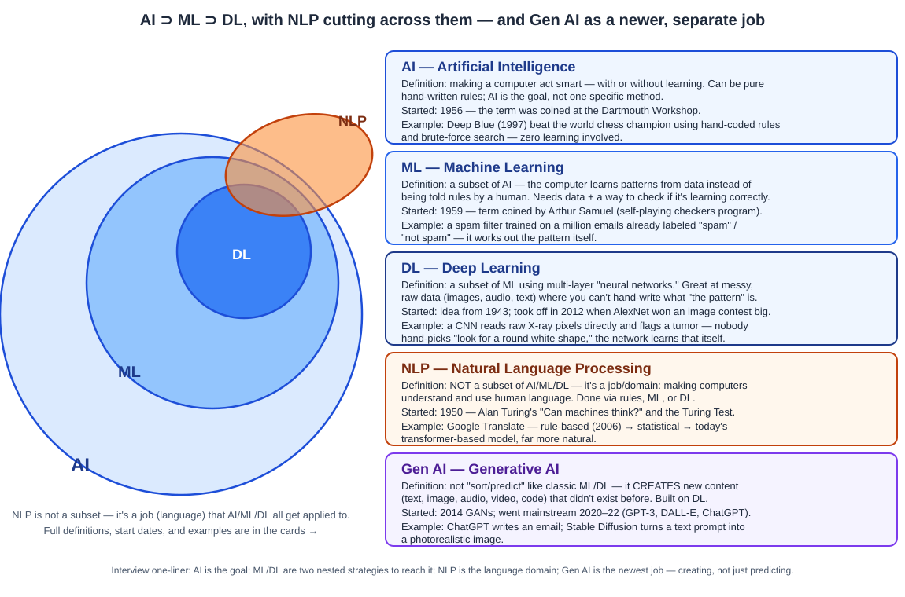

# Day 01 Notes — AI, ML, DL, NLP & the Road to Agentic AI

**Module:** Module 2 · **Objectives covered:** AI/ML/DL/NLP differences · evolution to Agentic AI · what "agentic" means · real-world use cases

## TL;DR

AI is the goal, ML is a strategy for reaching it (learn from data instead of hand-coding rules), DL is a
technique within ML (layered neural networks), and NLP is the domain where all three get applied to
language. Agentic AI is the newest stage in a decades-long trend: each generation of AI removed one more
constraint on autonomy, and the current generation removes the last one — the system now decides *what to
do next* across multiple steps, instead of waiting for a human to prompt every single action.

---

## 1. AI vs ML vs DL vs NLP

These are not four separate fields sitting side by side — three of them are nested inside each other, and
the fourth is a domain they all get applied to.

| Term | What it means | How it works | Real example |
|---|---|---|---|
| **AI** — Artificial Intelligence | The broad goal: machines doing things that normally need human intelligence | Can be hand-coded rules *or* learned — AI is the outcome, not a specific method | Deep Blue (1997) beating Kasparov at chess using brute-force search + hand-tuned evaluation rules, **no learning involved** |
| **ML** — Machine Learning | A *subset of AI*: the system learns patterns from data instead of being explicitly programmed | Feed it labeled examples, it fits a function that generalizes | A spam filter trained on millions of labeled emails; a bank's credit-scoring model trained on historical loan outcomes |
| **DL** — Deep Learning | A *subset of ML*: multi-layer neural networks that learn directly from raw, unstructured data | Layers of neurons learn hierarchical features automatically — no manual feature engineering | A CNN spotting tumors in X-ray images; a neural net doing real-time speech-to-text |
| **NLP** — Natural Language Processing | A *domain*, not a rung on the AI→ML→DL ladder: applying AI/ML/DL specifically to human language | Old NLP: regex and hand-written grammars. Modern NLP: transformer-based deep learning | Google Translate's 2006 version used statistical phrase-matching; today's version uses a transformer that models whole-sentence meaning |

**Why this distinction matters in practice:** when someone says "we're using AI," ask *which layer*. A
rule-based chatbot with a decision tree is AI but not ML. A recommendation engine is ML but might not be
DL. A GPT-based agent is DL applied to NLP, wrapped in an agentic control loop. Knowing which layer you're
at tells you what kind of engineering problems you'll actually hit (data quality for ML, compute/latency
for DL, ambiguity handling for NLP).

## 2. Evolution: rule-based systems → Agentic AI

| Era | Approach | Example | What limited it |
|---|---|---|---|
| 1950s–80s | Symbolic / rule-based ("expert systems") | MYCIN diagnosing bacterial infections via hand-written if-then rules | Brittle — fails on anything not explicitly anticipated by the rule author |
| 1990s–2010s | Statistical ML | Early spam filters, recommendation engines | Needs hand-engineered features; narrow, single-task |
| 2012–2020 | Deep learning | ImageNet-era image classifiers, early chatbots | Excellent at perception, but still one-shot input → output, no memory or planning |
| 2020–2023 | Large Language Models | GPT-3/4 answering questions, writing code in a single turn | Strong reasoning, but passive — waits for a prompt, produces one response, has no tools or persistent goal |
| 2023–now | **Agentic AI** | A system that plans, calls tools, checks its own output, and loops until a goal is satisfied | Needs orchestration (LangGraph, etc.) and guardrails, but achieves multi-step autonomous work |

**The throughline:** each era removes one constraint on the system.
- Rule-based → removed nothing; a human still encodes every decision path.
- ML → removed "a human must hand-code the logic" (the system infers it from data).
- DL → removed "a human must hand-engineer the features" (the network learns representations itself).
- LLMs → removed "you need a separate trained model per task" (one model generalizes across tasks via
  prompting).
- Agentic AI → removes "the system only acts when prompted for a single response" (it now decides what to
  do next, across many steps, until the goal is met).

## 3. What actually makes a system "agentic"

A single LLM call that answers a question is **not** agentic — it's a pure function: input in, output out,
done. A system crosses into "agentic" territory when it has some combination of these traits:

1. **Goal-directedness** — given an objective, not a single-turn instruction.
   *"Book me the cheapest flight to Delhi next month"* (a goal) vs. *"Translate this sentence"* (a single-turn task).
2. **Planning** — it decomposes the goal into steps on its own, rather than following a script you wrote.
3. **Tool use** — it can act on the world (web search, call an API, run code, query a database), not just
   generate text.
4. **Memory / state** — it remembers what it already tried across steps, so it doesn't repeat failed actions.
5. **Iteration / self-correction** — it observes the outcome of its own action and adjusts (this is the
   "reflection" pattern, covered in Module 3).
6. **Bounded autonomy** — it runs multiple internal steps without a human approving *every* single one,
   though well-designed systems still add human checkpoints before risky actions (Module 11: guardrails).

**Quick test:** if the whole interaction could be captured as one request/response screenshot, it's
probably not agentic. If it took several internal decisions — plan, act, observe, replan — to arrive at
the result, it is.

## 4. Real-world use cases

- **Automation** — an agent reads incoming support emails, classifies intent, drafts a reply, checks the
  draft against company policy, and only escalates to a human when its confidence is low. This is the
  guardrail pattern from Module 11 in action.
- **Copilots** — tools like GitHub Copilot or Cursor now do more than autocomplete: they read the
  codebase, plan a multi-file change, run the test suite, and iterate on failures. That loop is close to
  the planner-executor architecture covered in Module 3.
- **Assistants** — an assistant asked to "find flights, check my calendar for conflicts, and book the one
  that fits" has to call multiple tools (flight search, calendar API, payment) and sequence them correctly.
  That's exactly the agent loop built starting in Module 5 (LangGraph) and standardized with Module 9 (MCP).

## Sources

- [Building Effective AI Agents — Anthropic](https://www.anthropic.com/engineering/building-effective-agents)
- [Agentic AI vs. Traditional AI — GeeksforGeeks](https://www.geeksforgeeks.org/artificial-intelligence/agentic-ai-vs-traditional-ai/)
- [Agentic AI vs Traditional AI: Key Differences — FullStack Blog](https://www.fullstack.com/labs/resources/blog/agentic-ai-vs-traditional-ai-what-sets-ai-agents-apart)
