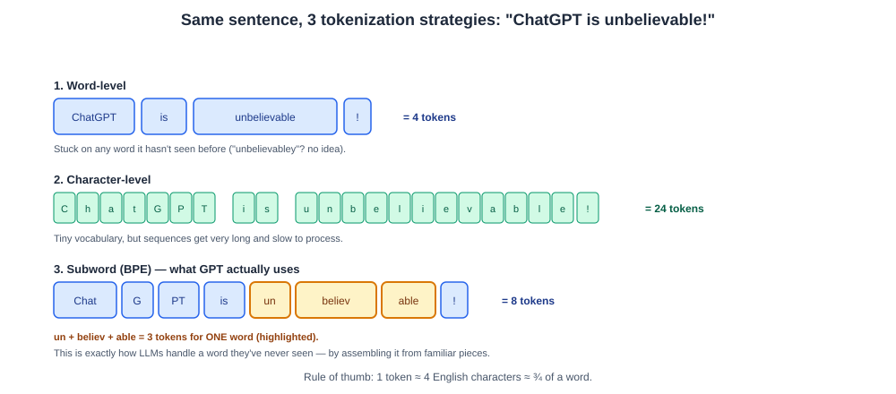
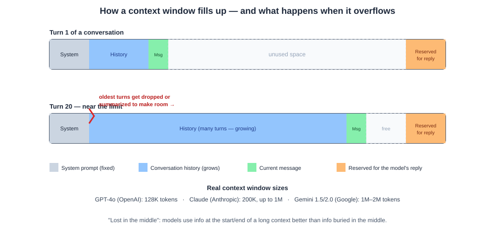
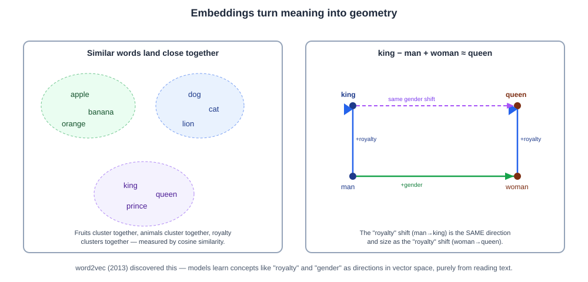
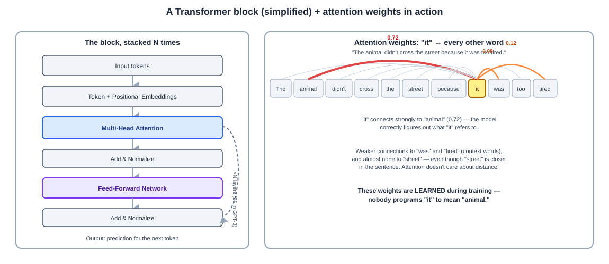
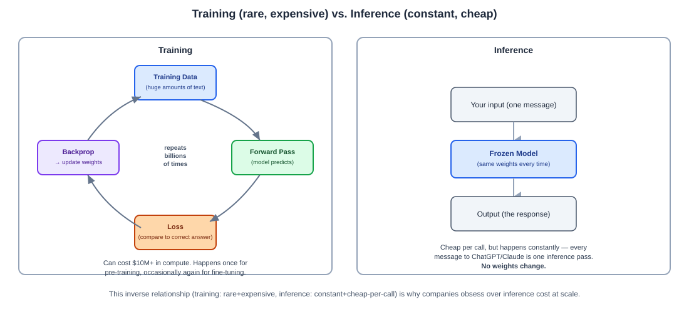

# Day 02 Notes — LLM Internals: Tokens, Context, Embeddings & Transformers

**Module:** Module 2 · **Objectives covered:** tokens/tokenization · context windows · embeddings ·
transformer architecture & attention · training vs. inference

## TL;DR (short version)

- **Tokens** = the small chunks of text an LLM actually reads — not letters, not whole words, usually
  word-pieces. Roughly 1 token ≈ 4 English characters.
- **Context window** = the total number of tokens (input + output together) a model can "see" in one
  request. Anything outside it is invisible to the model.
- **Embeddings** = turning text into a list of numbers that captures its *meaning*, so similar meanings
  end up as nearby numbers.
- **Transformers** = the architecture behind every modern LLM. The key trick is **attention** — every
  token directly looks at every other token to figure out what matters.
- **Training vs. inference** = training is the (very expensive, rare) process of teaching the model by
  adjusting its weights. Inference is the (cheap, constant) process of actually using the already-trained
  model to answer you.

---

## 1. Tokens and Tokenization

**Tokenization, in one line: breaking text into small pieces the model can actually read.**

Here's the root problem it solves: a computer doesn't understand words or letters at all — it only
understands numbers. So before any text can reach an LLM, it has to be chopped into small chunks
(**tokens**), and each chunk gets converted into a number. The model never sees the word "cat" — it
only ever sees a number that means "cat."

**Concrete example:**
```
"unhappiness"  →  "un" + "happi" + "ness"   →   [1917, 4102, 655]
        (text)         (tokens: 3 pieces)         (the numbers the model actually reads)
```
Three token-pieces, three numbers. That's genuinely the whole idea — chop the text into pieces, look
up each piece's number in the model's vocabulary, feed the model the numbers.

Sometimes a token is a whole word, sometimes it's just part of a word, and sometimes it's a single
punctuation mark — depends on how common that chunk is.

**Why not just make each token a whole word?** Human language has effectively unlimited "words" —
names, typos, slang, brand names, other languages. You can't build a fixed numbered list containing
every possible word. By breaking words into common sub-pieces instead, the model can handle a word it
has *never seen before* by assembling it from familiar pieces, the same way you could sound out an
unfamiliar word from its parts. Try it yourself: a tokenizer that's never seen "flibbertigibbet" can
still handle it, because it can break it into pieces it *has* seen — like "flib" + "ber" + "ti" +
"gibbet" — instead of getting stuck.

> **Why / How / Where / When**
> - **Why:** a model can't have a vocabulary entry for every possible word — human language is
>   effectively infinite (names, typos, slang, new brands).
> - **How:** subword algorithms (BPE, WordPiece, SentencePiece) break text into a fixed set of common
>   chunks, so any word — even one never seen before — can be assembled from familiar pieces.
> - **Where:** the very first step of every LLM pipeline. Nothing reaches the model as raw text — it's
>   always tokens first. Also drives API pricing, since most providers bill per token.
> - **When:** every single time text goes in or comes out of a model — during training AND inference,
>   with no exceptions.

**Types of tokenization:**

- **Word-level** — one token per word. Simple, but the vocabulary list becomes huge, and the model is
  completely stuck on any word it hasn't seen before.
- **Character-level** — one token per letter. Tiny vocabulary, but sequences become very long, which
  makes it slower and harder for the model to learn structure.
- **Subword tokenization** (what every modern LLM actually uses) — breaks words into common chunks
  that balance the two extremes above. The real, named algorithms:
  - **BPE (Byte Pair Encoding)** — used by GPT models. Starts from individual characters and
    repeatedly merges the most frequent pair, building up a vocabulary of common chunks.
  - **WordPiece** — used by BERT. Same basic idea as BPE, but picks merges that best improve the
    model's ability to predict the training data, not just raw frequency.
  - **SentencePiece** — used by many models (T5, LLaMA, and others). Treats the raw text (including
    spaces) as one stream, which makes it work well for languages without clear word boundaries, like
    Japanese or Chinese.



**Rule of thumb for interviews:** 1 token ≈ 4 characters in English, or roughly ¾ of a word — so 100
tokens ≈ 75 words. OpenAI's own tokenizer for GPT models is called `tiktoken`.

**Is the vocabulary preset, or does the model learn it while training?** Preset — every model has a
fixed vocabulary decided *before* training even starts:
```
Huge text corpus  →  run BPE/WordPiece/SentencePiece ONCE  →  fixed vocabulary (e.g. 100K entries)
                                                                        ↓
                                             THEN the model's actual weight-training begins
```
That vocabulary is then frozen for the model's whole lifetime — every model family builds its own from
its own data, so sizes differ (GPT-4o ≈ 200K tokens, LLaMA ≈ 32K, BERT ≈ 30K). Because subword
tokenizers can always fall back to smaller and smaller pieces (down to individual characters/bytes),
nothing is ever truly "out of vocabulary" — unlike old word-level tokenizers, which would get stuck on
any word missing from their fixed list.

## 2. Context Windows

The **context window** is the maximum number of tokens — input plus output, combined — that a model
can work with in a single request. Anything outside that window simply doesn't exist to the model: it
has no memory of anything that isn't explicitly included in the current context.

**Analogy:** think of it as the size of a whiteboard. Once the whiteboard is full, something has to be
erased to fit new writing — older parts of a long conversation get dropped or summarized once you go
past the limit.

```
Turn 1:   [System 80] + [History 120] + [Msg 40] + [free space] + [Reserved reply 80]  → mostly free
Turn 20:  [System 80] + [History 520] + [Msg 40] + [little free] + [Reserved reply 80] → nearly full
```

> **Why / How / Where / When**
> - **Why:** a model has a fixed amount of compute/memory it can spend per request — it cannot look at
>   an unlimited amount of text at once, no matter how powerful it is.
> - **How:** measured in tokens, and input + output share the *same* budget — a bigger reply leaves
>   less room for input, and vice versa.
> - **Where:** shows up directly in chat app design (how much history to keep), RAG (how many
>   retrieved documents you can stuff in), and long-document summarization.
> - **When:** it bites you the moment a conversation runs long or you try to paste in a large document
>   — that's when truncation, summarization, or "lost in the middle" problems start to appear.

**Real numbers (as of this course):**

- GPT-3.5: 4K–16K tokens
- GPT-4 / GPT-4o (OpenAI): 128K tokens
- Claude (Anthropic): 200K tokens, with some models supporting up to 1M
- Gemini 1.5/2.0 (Google): up to 1M–2M tokens

**Why it matters:**

- **Cost** — most APIs charge per token, so a bigger context sent on every request means a bigger bill.
- **Latency** — a bigger context takes longer to process before the model even starts answering.
- **"Lost in the middle"** — research has repeatedly shown models are best at using information placed
  at the *start* or *end* of a long context, and are more likely to miss something buried in the
  middle, even if it technically "fits."
- **Long conversations** — once a chat's history grows past the window, older messages have to be
  dropped or summarized to make room for new ones.



## 3. Embeddings and Vector Representations

An **embedding** is a way of turning a piece of text (a word, a sentence, a whole document) into a
list of numbers — a **vector** — that captures its *meaning*, not just its spelling. Texts with
similar meaning end up with vectors that are close together in this number-space, even if they don't
share a single letter.

**How does a vector actually get formed? Is there a vocabulary lookup involved?** Yes — there are two
layers to this, and they connect directly to tokenization (Section 1):

**1. Inside the model, every token starts from a lookup table.** After tokenization gives you a token
ID (a single integer), the model has a giant table called the **embedding matrix** — one row per
vocabulary entry (e.g. ~50,000 rows for GPT), and each row is a vector of numbers (e.g. 768 or 4096 of
them, called the "embedding dimension"). Getting a token's starting vector is just a lookup, nothing
fancier:
```
"cat"  →  token ID 5023  →  look up row 5023 in the embedding table  →  [0.12, -0.87, ..., 0.05]
```
This table isn't hand-built — it starts as random numbers and gets adjusted during training (Section
5), the same way every other weight does, until similar tokens naturally end up with similar rows.

**2. That starting vector then gets reshaped by context as it flows through the model** (this is what
attention in Section 4 actually does) — so the word "bank" starts from the same lookup-table row in
"river bank" and "bank account," but ends up with two *different* final vectors once attention has
mixed in the surrounding words.

**3. For whole sentences/documents (what RAG and search actually use), a separate embedding model does
this end-to-end in one step** — not a simple lookup, but a full neural network trained specifically so
that similar *meaning* ends up as nearby vectors:
```
"The cat sat on the mat"  →  embedding model (e.g. text-embedding-3)  →  [0.44, -0.12, ..., 0.91]
```
One dense vector for the entire sentence — this is the kind of embedding used for semantic search and
RAG (Section 3's "why this matters" below), not the per-token lookup-table vector from step 1.

**Example:** the vectors for "dog" and "puppy" will land close together, while "dog" and "airplane"
will land far apart.

**Classic example (word2vec, 2013):** `vector("king") - vector("man") + vector("woman") ≈
vector("queen")`. The model learned "royalty" and "gender" as *directions* in this number-space,
purely from reading text — nobody ever told it what a king or a queen is.

**How do you compare two embeddings?** With **cosine similarity** — it measures the angle between two
vectors, not their length. A cosine similarity near **1** means very similar meaning, near **0** means
unrelated, and near **-1** means opposite.

> **Why / How / Where / When**
> - **Why:** computers can't compare "meaning" directly — they need numbers to do math on. Exact
>   keyword matching also fails whenever the wording differs even though the meaning is the same.
> - **How:** a neural network is trained so that texts with similar meaning end up as nearby vectors;
>   you then compare vectors with cosine similarity.
> - **Where:** semantic search, RAG retrieval (Modules 4 &amp; 6), recommendation systems, clustering.
> - **When:** computed once per document when you build a knowledge base (offline, in bulk), and again
>   for every new user query (online, one at a time) so you can find the closest matches.



**Why this matters for this course:** embeddings are the backbone of **semantic search** and **RAG**
(Modules 4 and 6). Instead of matching exact keywords, you convert both the user's question and every
document into embeddings, and retrieve the documents whose vectors are *closest* to the question's
vector — so a search for "how do I get my money back" can still find a document titled "refund
policy," even though they share no words.

**Common embedding models:** OpenAI's `text-embedding-3`, Google's Gecko, Cohere Embed, and popular
open-source options like `sentence-transformers` (e.g. `all-MiniLM`) — plus the older, word-level
models that started it all: Word2Vec and GloVe.

## 4. Transformer Architecture and Attention

Every modern LLM (GPT, Claude, Gemini, LLaMA) is built on the **Transformer** architecture, introduced
in the 2017 paper *"Attention Is All You Need."* Transformers replaced the older RNN/LSTM approach
(Day 01) because they process a whole sequence **at once** instead of one token at a time, using a
mechanism called **attention**.

**Self-attention, in plain words:** for every token, the model asks *"which other tokens in this
sentence should I pay attention to, to understand THIS token correctly?"* — and assigns a weight to
every other token showing how much it matters.

**Classic example:** *"The animal didn't cross the street because it was too tired."* To figure out
what "it" refers to, the model needs to connect "it" strongly to "animal," not "street." Self-attention
is exactly the mechanism that lets it make that connection directly, no matter how many words sit in
between.

```
"it"  →  attention scores against every other word  →  animal: 0.72, tired: 0.12, was: 0.08, street: ~0.01
```

> **Why / How / Where / When**
> - **Why:** the older RNN approach (Day 01) reads one token at a time and forgets far-back context, and
>   it can't be parallelized well, which makes training slow. Language needed an architecture that
>   connects distant words directly and trains fast on modern GPUs.
> - **How:** self-attention scores how relevant every token is to every other token; multi-head
>   attention runs several of these scoring passes in parallel; the result is stacked into many layers
>   (e.g. 96 in GPT-3) for deeper understanding.
> - **Where:** the base architecture of literally every modern LLM — GPT, Claude, Gemini, LLaMA, BERT.
>   If it's a large language model released after 2018, it's almost certainly Transformer-based.
> - **When:** introduced in 2017 ("Attention Is All You Need"). Used both during training (to learn the
>   attention weights) and during inference (to process your prompt, using those learned weights).

**The building blocks:**

- **Token + positional embeddings** — every token is converted to a vector (Section 3), and
  information about its *position* in the sentence gets added in, since attention on its own has no
  sense of word order.
- **Multi-head attention** — the model doesn't compute attention just once; it computes it several
  times in parallel ("heads"). Each head can specialize — one might track grammar, another might track
  "who is doing what to whom."
- **Feed-forward layers** — after attention, each token's representation passes through a small neural
  network for further processing.
- These blocks are **stacked** many times (GPT-3, for example, stacks 96 layers) to build up deeper
  and deeper understanding.



## 5. Training vs. Inference

**Training** = teaching the model. You feed it a huge amount of data, it makes a prediction, you
compare that prediction to the real answer (the difference is called the **loss**), and you nudge
millions or billions of internal numbers (**weights**) slightly to make the next prediction a bit
better. Repeat this process billions of times. This is extremely expensive — training a large model
can cost tens of millions of dollars in compute — and it happens rarely: once for pre-training, then
occasionally again for fine-tuning or updates.

**Inference** = using the model. You give the already-trained, **frozen** model a new input, and it
produces an output in a single pass — no weights change. This is what happens every single time you
send a message to ChatGPT or Claude. It's far cheaper per use than training, but it happens millions of
times a day across every user.

**Analogy:** training is like years of medical school — expensive, slow, and mostly a one-time thing.
Inference is like a doctor seeing a patient — fast, drawing on everything already learned, with no
re-studying required for each visit.

```
Training:   Data → Predict → Compare to correct answer (Loss) → Adjust weights → repeat billions of times
Inference:  Your input → Frozen model (same weights) → Output          → one pass, no weight changes
```

> **Why / How / Where / When**
> - **Why:** a model has to *learn* a language and a huge amount of world knowledge before it's useful
>   (training), and then needs a fast, cheap way to actually be used by millions of people afterward
>   (inference) — these are two very different jobs with very different cost profiles.
> - **How:** training repeats forward pass → loss → backpropagation → weight update, billions of times.
>   Inference is one forward pass through the already-trained, frozen weights — no learning happens.
> - **Where:** training happens inside the model creator's own data centers (OpenAI, Anthropic, Google,
>   etc.). Inference happens wherever the model is deployed — an API call, a chat app, an agent's tool
>   call — anywhere a request reaches the model.
> - **When:** training happens rarely — once for pre-training, occasionally again for fine-tuning.
>   Inference happens constantly — every single message you send is one inference call.



### Quick comparison

| | Training | Inference |
|---|---|---|
| Goal | Learn the weights | Use the weights |
| Data needed | Huge amounts (often self-supervised, see Day 01) | Just your one input |
| Cost | Very high, mostly a one-time/rare cost | Low per request, but happens constantly |
| Changes the model's weights? | Yes | No |
| Real example | Pre-training GPT-4 on a huge text corpus | You asking ChatGPT a question right now |

## Interview Q&A (Day 02)

**Q1. What is a token, and why don't LLMs just use whole words?**
A token is a chunk of text — sometimes a whole word, often a piece of one. LLMs use subword tokens
instead of whole words because human language has effectively unlimited possible words (names, typos,
slang); subword tokenization lets the model handle a word it has never seen by assembling it from
familiar pieces, instead of getting stuck.

**Q1a. Is a model's vocabulary preset, or learned during training?**
Preset. The vocabulary is built once, before the model's actual weight-training even starts, by
running BPE/WordPiece/SentencePiece over a large text corpus. It's then frozen for the model's
lifetime. Every model family builds its own vocabulary from its own data (GPT-4o ≈ 200K tokens, LLaMA
≈ 32K, BERT ≈ 30K), so vocabularies differ across models but are fixed within a given model.

**Q2. Name the common tokenization algorithms and one model that uses each.**
BPE (Byte Pair Encoding) — used by GPT models. WordPiece — used by BERT. SentencePiece — used by T5,
LLaMA, and others; it's especially useful for languages without clear word boundaries like Japanese.

**Q3. What is a context window, and what happens when a conversation exceeds it?**
The context window is the maximum number of tokens (input + output combined) a model can process in
one request. Once a conversation's history grows past that limit, older messages have to be dropped or
summarized to make room — the model literally cannot see anything outside the window.

**Q4. What is the "lost in the middle" problem?**
Research shows LLMs are best at using information placed at the very start or very end of a long
context, and are more likely to miss or under-use information buried in the middle — even though it
technically fits within the context window. This matters a lot for RAG system design (Module 6).

**Q5. What is an embedding, and how do you measure whether two embeddings are similar?**
An embedding is a numerical vector representation of text that captures meaning rather than exact
wording — similar meanings produce nearby vectors. Similarity is typically measured with cosine
similarity, which compares the angle between two vectors: close to 1 means very similar, close to 0
means unrelated.

**Q5a. How does a token actually become a vector — is there a vocabulary lookup involved?**
Yes. After tokenization assigns a token an ID (an integer), the model has an embedding matrix — one
row per vocabulary entry, each row a vector of numbers. Getting a token's starting vector is a lookup:
ID 5023 → row 5023 of the table → e.g. `[0.12, -0.87, ..., 0.05]`. That table starts random and is
learned during training. As the vector then flows through the Transformer's attention layers, it gets
reshaped by context — so the same starting row for "bank" ends up as two different final vectors in
"river bank" vs. "bank account." Whole-sentence embeddings (used in RAG) work differently — a separate
embedding model maps the entire sentence to one vector directly, not via a per-token lookup.

**Q6. What's the famous word2vec example that shows embeddings capture meaning, not just words?**
`vector("king") - vector("man") + vector("woman") ≈ vector("queen")`. The model learned concepts like
"royalty" and "gender" as directions in vector space purely from text, without ever being told what a
king or queen actually is.

**Q7. Why did Transformers replace RNNs/LSTMs for language models?**
RNNs process one token at a time and pass a "memory" forward, so they struggle with long-range
dependencies and can't be parallelized well during training. Transformers use self-attention to let
every token directly connect to every other token in one pass, which solves the long-range problem and
trains much faster on modern hardware (GPUs/TPUs) because it's highly parallelizable.

**Q8. Explain self-attention in one sentence, with an example.**
Self-attention lets every token weigh how relevant every other token is to understanding it — e.g. in
"The animal didn't cross the street because it was too tired," attention connects "it" directly and
strongly to "animal" rather than "street," regardless of the distance between them.

**Q9. What is multi-head attention, and why use more than one head?**
Instead of computing attention once, the model computes it several times in parallel ("heads"), and
each head can specialize in a different kind of relationship — e.g. one head tracking grammatical
structure, another tracking coreference (like "it" → "animal"). Combining multiple heads gives the
model a richer understanding than a single attention computation could.

**Q10. What's the practical difference between training and inference in terms of cost and frequency?**
Training adjusts the model's weights using huge amounts of data and is extremely expensive but
infrequent — it happens once for pre-training and occasionally for fine-tuning. Inference uses the
already-trained, frozen model to produce an output for a single input, doesn't change any weights, and
is cheap per call but happens constantly — every single chat message is one inference call.

## Sources

- [Attention Is All You Need (arXiv, 2017)](https://arxiv.org/abs/1706.03762)
- [The Illustrated Transformer — Jay Alammar](https://jalammar.github.io/illustrated-transformer/)
