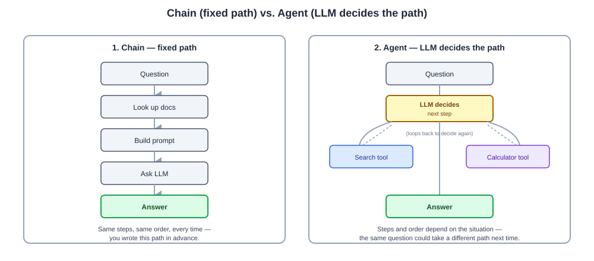
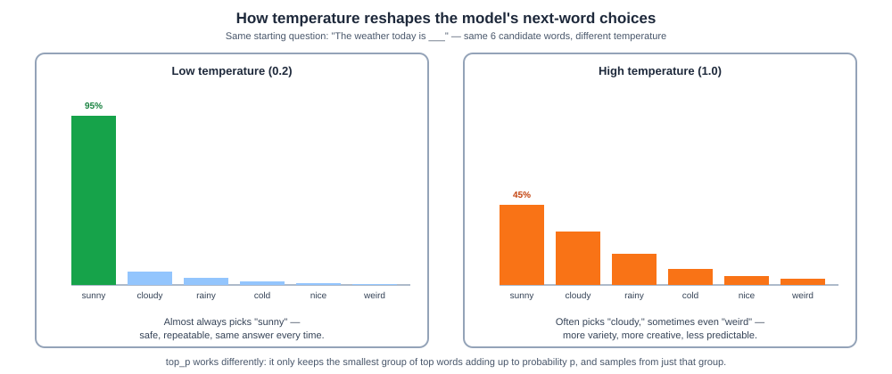

# Day 03 Notes — LLM App Frameworks & Prompt Engineering

**Module:** Module 2 · **Objectives covered:** why frameworks exist · chains vs. agents vs. tools ·
LangChain/LangGraph/LangSmith/Langfuse · structuring prompts · temperature/max tokens/top-p

## TL;DR (short version)

- **Frameworks** exist so you don't rebuild the same plumbing (memory, retrieval, tool-calling) from
  scratch for every LLM app.
- A **chain** = a fixed path you wrote in advance. An **agent** = the LLM decides its own path. A
  **tool** = one single capability either of them can use.
- **LangChain** = build it. **LangGraph** = build it with more control (loops, branches). **LangSmith**
  / **Langfuse** = watch it (debug, trace, monitor).
- A good prompt has 3 parts: **instructions** (the task), **context** (the background info),
  **expected output** (the format you want back).
- **Temperature** and **top-p** control how random/creative a reply is. **Max tokens** caps how long it
  can be.

---

## 1. Why do LLM apps need a framework?

You *can* just call an LLM API directly — send text, get text back. That works for a demo. It stops
working once your app needs more than one prompt.

**Example:** a real chatbot needs to remember earlier turns, pull in your own documents, maybe call a
calculator or a search tool, handle errors, and track cost. Building all of that yourself, every time,
for every project, is slow and easy to get wrong.

A framework (like LangChain) gives you ready-made pieces for all of this — so you snap pieces together
instead of building each one from zero.

> **Why / How / Where / When**
> - **Why:** the same plumbing (memory, retrieval, tool-calling, error handling) shows up in almost
>   every real LLM app. Rebuilding it each time wastes effort and invites bugs.
> - **How:** frameworks give reusable building blocks — chains, memory, retrievers, tools, agents —
>   that you connect together instead of writing from scratch.
> - **Where:** any LLM app beyond "one prompt in, one answer out" — chatbots with memory, RAG apps,
>   agents that use tools.
> - **When:** reach for a framework the moment your app needs more than a single API call.

## 2. Chains vs. Agents vs. Tools

Three words that get mixed up a lot. Here's the simple version:

- **Tool** = one single capability — a calculator, a web search, a database lookup. It just does its
  one job when asked. It isn't "smart" by itself.
- **Chain** = a **fixed path** you (the developer) wired together in advance. The steps and their order
  never change.
- **Agent** = the **LLM decides its own path**, choosing which steps to take and which tools to use,
  based on the situation. This is what makes a system "agentic" (Day 01).

```
Chain (fixed path, always the same):
  question → [look up docs] → [build prompt] → [ask LLM] → answer

Agent (LLM decides the path itself):
  question → LLM: "I need to search first" → uses Search tool
           → LLM: "Now I need a calculation" → uses Calculator tool
           → LLM: "I have enough, answer now" → answer
```



> **Why / How / Where / When**
> - **Why:** some tasks have a known, fixed set of steps — that's cheap and predictable, so use a
>   chain. Other tasks need step-by-step decisions that depend on what happens along the way — that
>   needs an agent.
> - **How:** a chain is code connecting fixed steps. An agent is an LLM given a set of tools and told
>   to figure out its own steps, usually in a loop (Day 01's Plan → Act → Observe → Reflect).
> - **Where:** chains power predictable pipelines (a standard RAG lookup). Agents power open-ended
>   tasks ("research this and summarize it") where the exact steps aren't known in advance.
> - **When:** start with a chain if you can predict every step. Move to an agent only when you
>   genuinely can't.

## 3. Framework tour: LangChain, LangGraph, LangSmith, Langfuse

One short line each — memorize this and you have the map:

- **LangChain** — the toolbox. Ready-made pieces for prompts, LLM calls, retrievers, memory, and
  tools. Most people's starting point for building a chain.
- **LangGraph** — for building agents with more control. Lets you draw your agent's logic as a graph
  (boxes and arrows) with branches and loops, instead of one straight line. Full detail in Module 5.
- **LangSmith** — the debugging tool. Shows you every step your chain/agent actually took, so you can
  see why an answer went wrong, and tracks cost and latency.
- **Langfuse** — an open-source alternative to LangSmith. Same idea: tracing, logging, and evaluating
  your app's behavior over time. Full detail in Module 12.

**Simple memory hook:** LangChain and LangGraph = **build** it. LangSmith and Langfuse = **watch** it.

> **Why / How / Where / When**
> - **Why:** building an LLM app and understanding/debugging one are two different jobs, so different
>   tools exist for each.
> - **How:** LangChain/LangGraph wire pieces together into a running app. LangSmith/Langfuse sit
>   alongside that app and record every step it takes.
> - **Where:** LangChain/LangGraph inside your app's code. LangSmith/Langfuse as a separate dashboard
>   you check when something goes wrong or you want to measure quality/cost.
> - **When:** you need LangChain/LangGraph from day one of building. You'll reach for LangSmith/Langfuse
>   the first time an answer is wrong and you need to know *why*.

## 4. Structuring prompts: instructions, context, expected output

A good prompt usually has three clearly separated parts:

- **Instructions** — what you want the model to *do*.
- **Context** — the background information it needs (documents, data, conversation history).
- **Expected output** — what *form* the answer should take (one sentence? JSON? a bullet list?).

**Example:**
```
Instructions:      Summarize the following customer review in one sentence.
Context:           [the actual review text goes here]
Expected output:   Respond with exactly one sentence. No preamble.
```

> **Why / How / Where / When**
> - **Why:** LLMs are very sensitive to *how* you ask. A vague prompt gets a vague, inconsistent
>   answer — every time you skip a part, you're leaving room for the model to guess wrong.
> - **How:** write the three parts as clearly labeled, separate sections instead of one blended
>   paragraph. Be explicit about format, especially if your code needs to parse the answer.
> - **Where:** every single LLM call in any real application — this is the most basic, most important
>   skill in this whole course.
> - **When:** always, but it matters most when you need a reliable, parseable output (like JSON your
>   code will read).

## 5. Controlling responses: temperature, max tokens, top-p

Three settings you pass alongside your prompt, on every API call:

- **Temperature** — controls how random/creative the reply is.
- **Max tokens** — a hard limit on how long the reply can be (this is the "reserved output" slice of
  the context window from Day 02).
- **Top-p** (nucleus sampling) — a different way to control randomness: instead of a single dial, it
  only considers the smallest group of most-likely next words that add up to probability *p* (e.g.
  0.9), then picks among just those.

**How temperature actually works:** imagine the model has a ranked list of possible next words, most
likely first.

```
temperature = 0  →  always picks the #1 most likely word  →  same answer every time, safe and boring
temperature = 1  →  sometimes picks a less likely word     →  more variety, more creative, less predictable
```



> **Why / How / Where / When**
> - **Why:** different tasks need different amounts of randomness. A factual Q&A bot wants
>   consistency. A brainstorming assistant wants variety.
> - **How:** set as parameters on the API call — `temperature`, `max_tokens`, `top_p` — alongside your
>   prompt.
> - **Where:** every major LLM API (OpenAI, Anthropic, Google) exposes these same three controls.
> - **When:** low temperature (near 0) for facts, code, and structured output. Higher temperature
>   (0.7–1) for brainstorming and creative writing. `top_p` is usually left at its default (around 1)
>   unless you specifically want to narrow the model's choices.

## Interview Q&A (Day 03)

**Q1. Why would you use a framework like LangChain instead of calling the OpenAI/Anthropic API directly?**
Direct API calls work for a single prompt-response. Real apps need memory across turns, retrieval from
your own documents, tool-calling, and error handling — a framework gives reusable building blocks for
all of that instead of building each piece from scratch for every project.

**Q2. What's the difference between a chain, an agent, and a tool?**
A tool is one single capability (a calculator, a search function). A chain is a fixed sequence of steps
wired together in advance by the developer — the path never changes. An agent is the LLM deciding its
own sequence of steps and which tools to use, based on the situation, rather than following a path you
pre-wrote.

**Q3. When would you choose a chain over an agent?**
When you can predict every step in advance. Chains are cheaper, faster, and easier to debug because the
path is fixed. Use an agent only when the task genuinely requires step-by-step decisions that depend on
what happens along the way.

**Q4. What's the difference between LangChain, LangGraph, LangSmith, and Langfuse?**
LangChain and LangGraph are for *building* — LangChain for chains, LangGraph for agents with branches
and loops. LangSmith and Langfuse are for *watching* — tracing every step an app took, for debugging
and monitoring cost/latency/quality. Langfuse is the open-source alternative to LangSmith.

**Q5. What are the three parts of a well-structured prompt?**
Instructions (what to do), context (the background information needed), and expected output (what
format the answer should take). Separating these clearly reduces ambiguity and makes the model's output
more consistent and easier to parse.

**Q6. What does temperature control, and what would you set it to for a customer support bot vs. a
creative writing tool?**
Temperature controls how random the model's word choices are — low temperature always picks the most
likely next word (consistent, repeatable), high temperature sometimes picks less likely words (more
varied, more creative). A customer support bot should use low temperature (near 0) for consistent,
accurate answers. A creative writing tool should use a higher temperature (0.7–1) for variety.

**Q7. What's the difference between temperature and top-p?**
Temperature reshapes how sharply the model favors the most likely word vs. spreading probability across
options. Top-p (nucleus sampling) instead picks the smallest group of top words whose probabilities add
up to a threshold (e.g. 0.9), and samples only from that group. Both control randomness, but through
different mechanisms — most teams pick one to tune and leave the other at its default.

**Q8. What does max_tokens actually limit?**
The maximum length of the model's reply, measured in tokens (Day 02). It doesn't affect the input — it
only caps how long the generated output can be, and shares the same overall context window budget as
the input.

## Sources

- [LangChain documentation](https://python.langchain.com/)
- [LangGraph documentation](https://langchain-ai.github.io/langgraph/)
