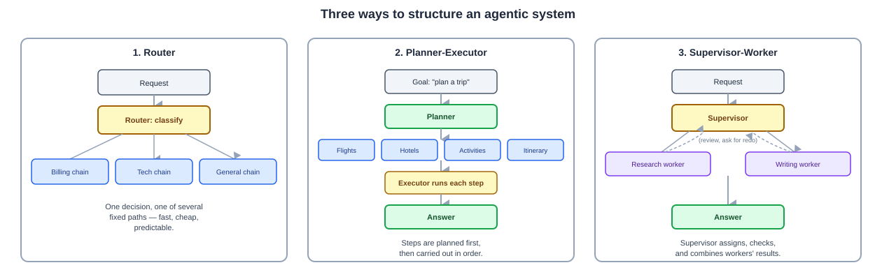

# Day 04 Notes — Agentic Architectures

**Module:** Module 3 · **Objectives covered:** router / planner-executor / supervisor-worker
architectures · perception/cognition/action/security modules · latency/cost/reliability/auditability

## TL;DR (short version)

- **Router** = look at the request, send it down one of several fixed paths. Simple, fast, cheap.
- **Planner-Executor** = break a goal into steps, then carry out each step in order. More flexible.
- **Supervisor-Worker** = one LLM manages several specialist LLMs, checking and combining their work.
  Most powerful, also slowest and most expensive.
- Every agent needs 4 things: **perception** (take in the situation), **cognition** (decide what to
  do), **action** (do it), **security** (stop it from doing something unsafe).
- Every design choice trades off **latency**, **cost**, **reliability**, and **auditability** — you
  rarely get all four for free.

---

## 1. Three common agentic architectures

**Router — look at the request, send it down one fixed path.**

A small "router" step reads the incoming request and decides which of several ready-made paths should
handle it, like a receptionist pointing visitors to the right department.

**Example:** a support bot gets a message. The router decides: "this is a billing question" →
sends it to the billing chain. "This is a technical question" → sends it to the tech-support chain.

**Planner-Executor — break the goal into steps, then carry them out one by one.**

A "planner" LLM turns a big goal into a list of smaller steps. An "executor" then carries out each step
in order, often calling tools along the way.

**Example:** *"Plan a trip to Paris."* → Planner produces: `[find flights, find hotels, find
activities, build an itinerary]`. → Executor runs each step, using a flight-search tool, a
hotel-search tool, and so on.

**Supervisor-Worker — one LLM manages several specialist LLMs.**

A "supervisor" LLM assigns pieces of a task to "worker" LLMs (each maybe specialized — one for
research, one for writing, one for coding), checks their output, and decides what happens next: accept
it, ask for a redo, or combine several workers' results.

**Example:** a research request comes in. The supervisor sends "search the web" to a research worker
and "draft the report" to a writing worker, reviews both, and asks the research worker to dig deeper if
something's missing.



> **Why / How / Where / When**
> - **Why:** different tasks need different amounts of structure. A small number of clearly separate
>   request types doesn't need a full multi-agent system — that would be slower and more expensive
>   than necessary. A genuinely complex, multi-skill task does need one.
> - **How:** router = one classification step + fixed downstream paths. Planner-executor = one LLM call
>   to plan, then a loop of execution steps. Supervisor-worker = one LLM coordinating calls to several
>   other LLMs/agents, reviewing their output.
> - **Where:** routers power support bots and simple multi-intent apps. Planner-executor powers
>   task-automation agents. Supervisor-worker powers complex research/writing/coding systems (this is
>   the pattern behind Project 2 later in this course).
> - **When:** start with a router if your task has a small, known set of categories. Move to
>   planner-executor when the steps are knowable but need to run in sequence. Move to supervisor-worker
>   only when the task genuinely needs multiple different skills working together.

## 2. The four modules every agent needs

Think of these the same way you'd describe a person doing a task — eyes, brain, hands, and judgment:

- **Perception** — taking in the current situation: the user's message, retrieved documents, a tool's
  result. This is "what's happening right now."
- **Cognition** — the thinking part: reasoning about what it means and deciding what to do next. This
  is the Plan/Reflect part of Day 01's agent loop.
- **Action** — actually doing something: calling a tool, sending a reply, writing to a database. This
  is the Act part of Day 01's loop.
- **Security** — the safety layer wrapped around all of the above: checking inputs, checking
  permissions, blocking unsafe actions, sometimes requiring a human to approve before acting (full
  detail in Module 11).

```
A person doing a task:  eyes/ears (perception)  →  brain decides (cognition)  →  hands act (action)
                                        judgment stops you before doing something unsafe (security)
```

> **Why / How / Where / When**
> - **Why:** without all four, an agent either can't understand its situation, can't decide anything
>   useful, can't actually do anything, or can't be trusted to run safely.
> - **How:** perception = inputs/retrieval. Cognition = the LLM's reasoning step. Action = tool calls.
>   Security = validation and approval checks wrapped around the action step specifically, since that's
>   where real-world harm can happen.
> - **Where:** every agentic system, no matter which architecture from Section 1 it uses.
> - **When:** security checks matter most right before an action with real consequences — sending
>   money, deleting data, sending an email — not before, say, just reading a document.

## 3. Design tradeoffs: latency, cost, reliability, auditability

Four things you're always trading off against each other when you pick an architecture:

- **Latency** — how long the user waits. More steps, more tool calls, more agents = slower.
- **Cost** — every LLM call costs money. More steps/agents = more calls = a bigger bill.
- **Reliability** — does it work the same way every time? Simple, fixed paths (routers, chains) are
  more predictable than architectures where an LLM decides its own steps.
- **Auditability** — can you explain *why* the system did what it did? Matters for debugging,
  compliance, and trust (this is where Module 7/8's "provenance" and "graph traces" come back).

**Rough comparison:**

| Architecture | Latency | Cost | Reliability | Auditability |
|---|---|---|---|---|
| Router | Fast | Cheap | High (fixed paths) | Easy (one decision to check) |
| Planner-Executor | Medium | Medium | Medium | Medium (a clear plan to inspect) |
| Supervisor-Worker | Slow | Expensive | Lower (many moving parts) | Hardest (many decisions to trace) |

> **Why / How / Where / When**
> - **Why:** more flexibility (an LLM deciding its own steps) always costs you something in speed,
>   money, predictability, or explainability — there's no free upgrade.
> - **How:** measure latency and cost directly (time and tokens per request). Measure reliability by
>   running the same input repeatedly and checking how consistent the output is. Measure auditability
>   by asking: could someone else read a trace of this run and understand why it did what it did?
> - **Where:** this tradeoff table is exactly what you weigh before picking an architecture for a
>   real production system, not just in an interview answer.
> - **When:** revisit this tradeoff whenever a task's requirements change — a prototype might start as
>   supervisor-worker for flexibility, then get simplified to a router once you learn the real request
>   patterns are actually few and predictable.

## Interview Q&A (Day 04)

**Q1. What's the difference between a router, a planner-executor, and a supervisor-worker architecture?**
A router classifies an incoming request and sends it down one of several fixed paths — no planning
involved. A planner-executor breaks a goal into an ordered list of steps, then executes them one by
one. A supervisor-worker has one LLM coordinating multiple specialist LLMs, assigning work and
reviewing their output before deciding what happens next.

**Q2. When would you choose a router over a supervisor-worker system?**
When the task has a small, known set of categories and each category has a clear, fixed way to handle
it — a router is faster, cheaper, and more predictable. Reach for supervisor-worker only when the task
genuinely needs multiple different skills coordinating together, since it's slower, more expensive, and
harder to debug.

**Q3. What are the four modules every agentic system needs, and give an example of each.**
Perception (reading the user's message or a tool's result), cognition (the LLM reasoning about what to
do next), action (calling a tool or sending a reply), and security (checking permissions or requiring
human approval before a risky action).

**Q4. Why does adding more agents/steps to a system hurt latency and cost, and what do you gain in
return?**
Every additional step or agent is at least one more LLM call, which adds time and token cost. What you
gain is flexibility — the ability to handle tasks whose exact steps aren't known in advance, by letting
the system plan, delegate, or coordinate rather than following one fixed path.

**Q5. Why is a supervisor-worker system harder to audit than a router?**
A router makes one decision (which path to take), so there's one thing to inspect. A supervisor-worker
system involves many decisions across multiple agents — what got delegated, what came back, what got
accepted or redone — so there are many more places something could have gone wrong, and tracing the
actual reasoning path is correspondingly harder.

## Sources

- [Building Effective AI Agents — Anthropic](https://www.anthropic.com/engineering/building-effective-agents)
