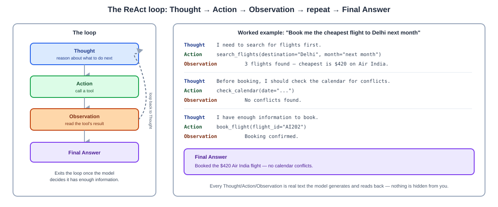

# Day 05 Notes — Agentic Design Patterns & ReAct

**Module:** Module 3 · **Objectives covered:** reflection/self-critique · tool-use · planning · the
ReAct framework · designing secure, predictable agents

## TL;DR (short version)

- **Reflection** = the agent checks its own work before finalizing, and fixes it if something's wrong.
- **Tool-use** = the agent can call real functions (search, code, a database) instead of just writing text.
- **Planning** = the agent makes an explicit list of steps before or during acting.
- **ReAct** = the most common pattern tying these together: alternate **Thought → Action →
  Observation**, in a loop, until there's enough to give a final answer.
- **Secure, predictable agents** = give them only the tools they need, require approval for risky
  actions, and bound how long a loop can run.

---

## 1. Reflection and self-critique

The agent checks its own answer *before* finalizing it, instead of submitting the first draft.

**Example:** a coding agent writes some code, runs the tests, sees a failure, reads the error message,
and fixes the code — that's reflection in action.

```
Draft answer  →  self-check: "is this actually right?"  →  no → revise  →  yes → finalize
```

> **Why / How / Where / When**
> - **Why:** an LLM's first attempt is often good but not perfect. Checking its own work catches
>   mistakes before they reach the user, the same way proofreading catches typos before you hit send.
> - **How:** after producing a result, run it through a check step (tests, a second LLM call asking
>   "review this," or comparing against the original goal) and loop back to fix it if it fails.
> - **Where:** coding agents (write code → run tests → fix), research agents (draft an answer → check
>   it's actually supported by the sources), any agent where "close enough" isn't good enough.
> - **When:** worth adding whenever a wrong first answer is costly — skip it for trivial, low-stakes
>   tasks where the extra LLM call isn't worth the added latency and cost (Day 04).

## 2. Tool-use

Instead of only generating text, the agent can call real functions — search the web, run code, query a
database, send an email. This is what turns a chatbot into something that can actually *do* things
(Day 01's "can take action" trait).

**How it works, mechanically:** the model is given a list of available tools, each with a name, a
description, and the inputs it expects. Based on the situation, the model decides which tool to call
and with what arguments — the system actually runs it, and feeds the result back to the model.

```
Model: "I need today's weather"  →  calls get_weather(city="Paris")  →  tool returns "18°C, cloudy"
                                                                              ↓
                                                          model uses that result in its answer
```

> **Why / How / Where / When**
> - **Why:** an LLM only knows what it learned during training (Day 02) — it can't check today's
>   weather or your calendar on its own. Tools give it a way to reach outside itself.
> - **How:** the model doesn't run code itself — it outputs "call this tool with these arguments," and
>   your system actually executes it and returns the result as text the model can read.
> - **Where:** OpenAI/Anthropic "function calling," and later in this course, MCP (Module 9)
>   standardizes exactly this pattern across many tools.
> - **When:** any time the answer depends on information or an action outside the model's training data
>   — current data, your own systems, anything that needs to actually happen in the world.

## 3. Planning

Before acting, the agent works out an explicit list of steps — either the whole plan upfront, or one
step at a time, adjusting as it learns more.

- **Plan up front, then execute** — make the full list of steps first (Day 04's planner-executor),
  then run them in order. Good when the steps are fairly predictable.
- **Plan one step at a time** — decide only the next step, act, see what happens, then decide the next
  one. Good when earlier results change what should happen next. This is what ReAct (Section 4) does.

## 4. The ReAct framework (Reasoning + Acting)

ReAct is the most common pattern for tying reflection, tool-use, and planning together. The model
alternates between three things, in a loop, out loud, in the text it generates:

- **Thought** — reason about what to do next, in plain text.
- **Action** — call a tool.
- **Observation** — read the tool's result.

...repeating until it has enough to give a **Final Answer**.

**Worked example** (same request from Day 01's "what makes a system agentic" section):
```
Question: Book me the cheapest flight to Delhi next month.

Thought:      I need to search for flights first.
Action:       search_flights(destination="Delhi", month="next month")
Observation:  3 flights found — cheapest is $420 on Air India.

Thought:      Before booking, I should check the calendar for conflicts.
Action:       check_calendar(date="...")
Observation:  No conflicts found.

Thought:      I have enough information to book.
Action:       book_flight(flight_id="AI202")
Observation:  Booking confirmed.

Final Answer: Booked the $420 Air India flight — no calendar conflicts.
```



> **Why / How / Where / When**
> - **Why:** letting the model "think out loud" between actions makes its reasoning visible and
>   auditable (Day 04), and lets it correct course if an observation doesn't match what it expected —
>   instead of committing to one plan blindly.
> - **How:** the prompt teaches the model to output Thought/Action/Observation in this exact pattern;
>   your system executes each Action, appends the Observation, and feeds the whole transcript back in
>   for the next Thought.
> - **Where:** the foundational pattern behind most modern coding agents, research agents, and the
>   LangGraph agent loops covered in Module 5.
> - **When:** introduced in a 2022 paper ("ReAct: Synergizing Reasoning and Acting in Language
>   Models"). Use it whenever a task needs more than one tool call to answer, and the right next step
>   depends on what the previous one returned.

## 5. Designing secure, scalable agents with predictable behavior

Bringing Day 04's security module and design tradeoffs into practice:

- **Limit the tools.** Give an agent only the tools it actually needs for its job — not every tool in
  the system. Fewer options means fewer ways to go wrong.
- **Require approval for risky actions.** Sending money, deleting data, sending an email to a customer
  — gate these behind a human check instead of letting the agent act unsupervised (full detail in
  Module 11).
- **Bound the loop.** Set a maximum number of Thought/Action/Observation rounds and a timeout, so a
  confused agent can't loop forever, burning time and money (Day 04's latency/cost tradeoffs).
- **Prefer read-only by default.** Give an agent read access before write access, and only expand
  permissions when there's a real need (this shows up again in Module 9's MCP servers).

## Interview Q&A (Day 05)

**Q1. What is the reflection pattern, and why does it matter?**
The agent checks its own output before finalizing it — e.g. a coding agent runs its own tests and fixes
failures before returning the result. It matters because an LLM's first attempt isn't always correct,
and catching mistakes before they reach the user is cheaper than not catching them at all.

**Q2. How does tool-use actually work, mechanically?**
The model is given a list of available tools with names, descriptions, and expected inputs. It decides
which tool to call and with what arguments; the system executes the tool (the model itself never runs
code), and the result is fed back to the model as text it can read and use.

**Q3. What is the ReAct framework, and what are its three repeating steps?**
ReAct ("Reasoning + Acting") has the model alternate between Thought (reasoning about what to do next),
Action (calling a tool), and Observation (reading the result), looping until it has enough information
to produce a Final Answer.

**Q4. Why is "thinking out loud" between actions useful, beyond just getting to the answer?**
It makes the model's reasoning visible and auditable — you can see exactly why it chose each action —
and it lets the model correct course mid-task if an observation doesn't match what it expected, instead
of committing blindly to a plan made before seeing any real results.

**Q5. What are three concrete things you'd do to make an agent more secure and predictable?**
Limit it to only the tools it actually needs, require human approval before risky/irreversible actions,
and bound the number of reasoning/action loops it's allowed to run so it can't spiral indefinitely.

## Sources

- [ReAct: Synergizing Reasoning and Acting in Language Models (arXiv, 2022)](https://arxiv.org/abs/2210.03629)
- [Building Effective AI Agents — Anthropic](https://www.anthropic.com/engineering/building-effective-agents)
