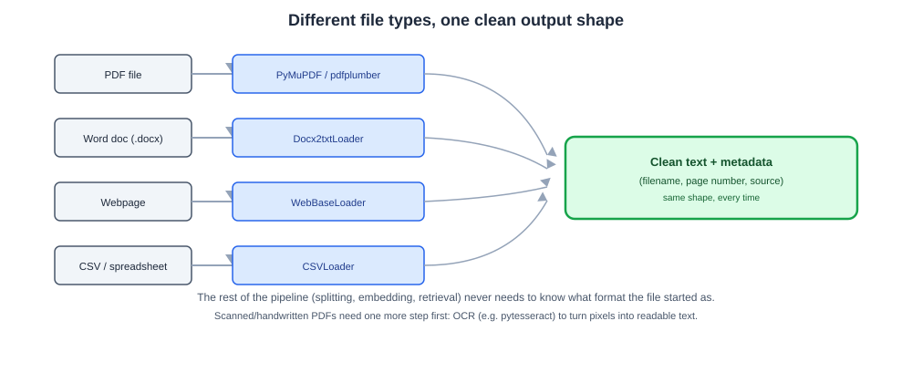
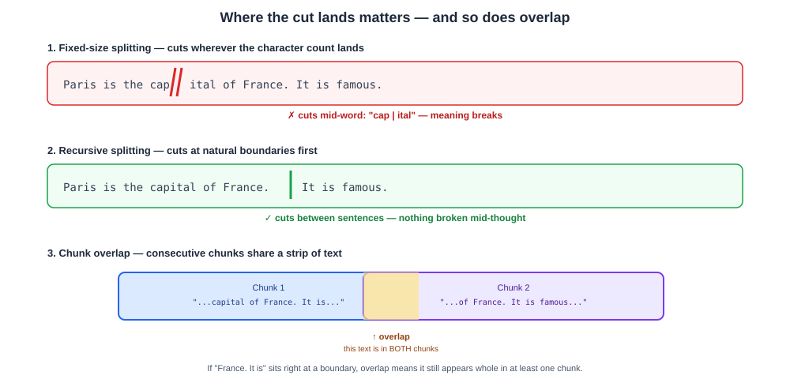

# Day 06 Notes — Data Ingestion & Splitting for LLM Pipelines

**Module:** Module 4 · **Objectives covered:** document loaders · text splitting strategies

## TL;DR (short version)

- **Document loaders** turn a messy file (PDF, Word doc, webpage) into clean text + metadata, so the
  rest of your pipeline doesn't have to care what format the file started in.
- **Text splitting** breaks that clean text into small chunks, because both context windows (Day 02)
  and RAG retrieval work better on small, focused pieces than one giant blob.
- **Chunk size + overlap** are the two settings that matter most — a typical real pipeline uses
  something like `chunk_size=2000`, `chunk_overlap=120`.

---

## 1. Data ingestion with document loaders

A **document loader** reads a file and converts it into a standard format — usually plain text plus
metadata (filename, page number) — that the rest of your pipeline can work with, no matter what the
file originally was.

**Why this is needed:** a PDF, a Word doc, and a webpage are all *completely* different internally — a
PDF has fonts, layout, and embedded images; a webpage is full of HTML tags; a Word doc is its own
zipped XML format. Without a loader, your pipeline would need custom parsing code for every file type.
The loader hides all of that mess.

```
Raw PDF file  →  document loader (parses layout, pulls out text/tables/images)  →  clean text + metadata
```

**Named loaders you'll actually use:**
- **PDFs** — PyMuPDF, pdfplumber, PyPDFLoader
- **Word docs** — Docx2txtLoader
- **Webpages** — WebBaseLoader
- **Spreadsheets/CSVs** — CSVLoader
- **Scanned/handwritten PDFs** — OCR tools like `pytesseract`, since there's no real text layer to
  extract — the loader has to read the pixels, not a text stream.



> **Why / How / Where / When**
> - **Why:** every downstream step (splitting, embedding, retrieval) expects plain text, not a raw
>   PDF's internal byte structure.
> - **How:** each file type gets its own loader that knows how to read that specific format; all of
>   them output the same shape — text plus metadata like filename and page number.
> - **Where:** the very first step of any RAG pipeline — before splitting, before embeddings.
> - **When:** every time a new document enters your system, whether that's once during setup or
>   continuously as new files arrive.

## 2. Text splitting strategies

A loaded document is often huge — way bigger than a context window (Day 02) or an embedding model can
handle well in one piece. **Splitting** breaks it into smaller chunks before anything else happens to
it.

**Why smaller chunks help retrieval, not just size limits:** in RAG, you're matching a user's specific
question against chunks by similarity (Day 02's embeddings). A whole book as one chunk is too broad to
match a specific question well. A small, focused chunk about one topic matches much better.

**Splitting strategies, from worst to best default:**
- **Fixed-size splitting** — cut every N characters, no matter what. Simple, but it can slice a
  sentence or even a word right in half, breaking meaning.
- **Recursive character splitting** (the common default — what your own project uses) — tries to
  split on natural boundaries first: paragraph breaks, then sentence breaks, then word breaks, only
  falling back to a hard cut if nothing else works. Keeps chunks readable.
- **Token-based splitting** — splits by token count (Day 02) instead of character count, since tokens
  are what actually count against context windows and API cost.
- **Semantic splitting** — uses embeddings to find natural topic-boundary points in the text, so each
  chunk stays about one coherent idea. More accurate, more expensive to compute.
- **Structure-aware splitting** — splits along headers/sections, and keeps tables or images as their
  own separate chunks instead of mixing them into surrounding text. A multi-modal RAG pipeline often
  tags each chunk with a `content_type` (`text`, `table`, `image`) so retrieval can treat them
  differently later.

**The two settings that matter most: chunk size and overlap.**
```
50,000-character document  →  split with chunk_size=2000, chunk_overlap=120  →  ~25 overlapping chunks
```
**Overlap** means consecutive chunks share a small strip of text at the boundary, so a fact or sentence
that happens to sit right at a cut point doesn't get lost — it still appears whole in at least one
chunk.



> **Why / How / Where / When**
> - **Why:** context windows and embedding models both have size limits, and retrieval accuracy drops
>   when chunks are too broad or cut mid-thought.
> - **How:** pick a splitting strategy (recursive is the safe default), set a chunk size that fits
>   comfortably within your embedding model's limit, and add a small overlap so boundary content isn't
>   lost.
> - **Where:** right after loading (Section 1), right before embedding (Day 02) — the "ingestion" step
>   of any RAG pipeline.
> - **When:** every document, every time it's ingested — this isn't a one-off setting, it's a step
>   that runs for every new file.

## Interview Q&A (Day 06)

**Q1. What does a document loader actually do, and why can't you skip it?**
It converts a specific file format (PDF, DOCX, webpage) into a standard shape — plain text plus
metadata — that the rest of the pipeline can work with. Skipping it would mean every downstream step
needs its own custom parsing logic for every possible file type, which doesn't scale.

**Q2. Why does RAG need text splitting at all — why not just embed the whole document?**
Two reasons: size limits (a whole document often exceeds context window and embedding model limits),
and retrieval quality (a whole document as one chunk is too broad to match a specific question well —
smaller, focused chunks retrieve more accurately).

**Q3. What's the difference between fixed-size and recursive character splitting?**
Fixed-size splitting cuts every N characters regardless of content, which can slice a sentence or word
in half. Recursive splitting tries natural boundaries first — paragraphs, then sentences, then words —
only falling back to a hard cut as a last resort, which keeps chunks more coherent.

**Q4. What is chunk overlap, and why does it matter?**
Overlap means consecutive chunks share a small strip of text at their boundary. It prevents a fact or
sentence sitting right at a cut point from being lost — it still appears whole in at least one chunk,
instead of being split across two chunks that neither fully contain it.

**Q5. Why would you split by token count instead of character count?**
Because context window limits and API costs are both measured in tokens (Day 02), not characters, and
1 token doesn't equal 1 character (roughly 4 characters per token in English) — splitting by character
count can produce chunks that are bigger or smaller than intended in terms of actual token budget.

## Sources

- [LangChain: Document loader integrations](https://docs.langchain.com/oss/python/integrations/document_loaders)
- [LangChain: Text splitter integrations](https://docs.langchain.com/oss/python/integrations/splitters)
