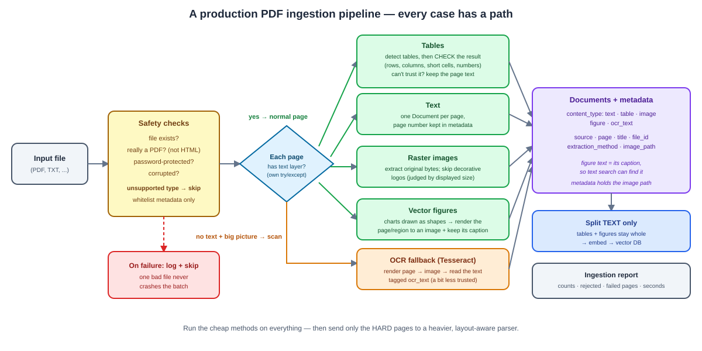

# Day 06 Notes — Data Ingestion & Splitting for LLM Pipelines

**Module:** Module 4 · **Objectives covered:** document loaders · text splitting strategies

## TL;DR (short version)

- **Document loaders** turn a messy file (PDF, Word doc, webpage) into clean text + metadata, so the
  rest of your pipeline doesn't have to care what format the file started in.
- **Text splitting** breaks that clean text into small chunks, because both context windows (Day 02)
  and RAG retrieval work better on small, focused pieces than one giant blob.
- **Chunk size + overlap** are the two settings that matter most — a typical real pipeline uses
  something like `chunk_size=2000`, `chunk_overlap=120`.
- **Real PDFs are messy** — scanned pages, tables, charts, broken files. Section 3 lists each case and
  what to do about it, and the notebook's Part 2 handles them one small step at a time on a real
  58-page paper.

---

## 1. Data ingestion with document loaders

A **document loader** reads a file and converts it into a standard format — usually plain text plus
metadata (filename, page number) — that the rest of your pipeline can work with, no matter what the
file originally was.

**Why this is needed:** a PDF, a Word doc, and a webpage are all *completely* different internally — a
PDF has fonts, layout, and embedded images; a webpage is full of HTML tags; a Word doc is its own
zipped XML format. Without a loader, your pipeline would need custom parsing code for every file type.
The loader hides all of that mess.

```
Raw PDF file  →  document loader (parses layout, pulls out text/tables/images)  →  clean text + metadata
```

**Named loaders you'll actually use:**
- **PDFs** — PyMuPDF, pdfplumber, PyPDFLoader
- **Word docs** — Docx2txtLoader
- **Webpages** — WebBaseLoader
- **Spreadsheets/CSVs** — CSVLoader
- **Scanned/handwritten PDFs** — OCR tools like `pytesseract`, since there's no real text layer to
  extract — the loader has to read the pixels, not a text stream.


> **Why / How / Where / When**
> - **Why:** every downstream step (splitting, embedding, retrieval) expects plain text, not a raw
>   PDF's internal byte structure.
> - **How:** each file type gets its own loader that knows how to read that specific format; all of
>   them output the same shape — text plus metadata like filename and page number.
> - **Where:** the very first step of any RAG pipeline — before splitting, before embeddings.
> - **When:** every time a new document enters your system, whether that's once during setup or
>   continuously as new files arrive.

## 2. Text splitting strategies

A loaded document is often huge — way bigger than a context window (Day 02) or an embedding model can
handle well in one piece. **Splitting** breaks it into smaller chunks before anything else happens to
it.

**Why smaller chunks help retrieval, not just size limits:** in RAG, you're matching a user's specific
question against chunks by similarity (Day 02's embeddings). A whole book as one chunk is too broad to
match a specific question well. A small, focused chunk about one topic matches much better.

**Splitting strategies, from worst to best default:**
- **Fixed-size splitting** — cut every N characters, no matter what. Simple, but it can slice a
  sentence or even a word right in half, breaking meaning.
- **Recursive character splitting** (the common default in real pipelines) — tries to
  split on natural boundaries first: paragraph breaks, then sentence breaks, then word breaks, only
  falling back to a hard cut if nothing else works. Keeps chunks readable.
- **Token-based splitting** — splits by token count (Day 02) instead of character count, since tokens
  are what actually count against context windows and API cost.
- **Semantic splitting** — uses embeddings to find natural topic-boundary points in the text, so each
  chunk stays about one coherent idea. More accurate, more expensive to compute.
- **Structure-aware splitting** — splits along headers/sections, and keeps tables or images as their
  own separate chunks instead of mixing them into surrounding text. A multi-modal RAG pipeline often
  tags each chunk with a `content_type` (`text`, `table`, `image`) so retrieval can treat them
  differently later.

**The two settings that matter most: chunk size and overlap.**
```
50,000-character document  →  split with chunk_size=2000, chunk_overlap=120  →  ~25 overlapping chunks
```
**Overlap** means consecutive chunks share a small strip of text at the boundary, so a fact or sentence
that happens to sit right at a cut point doesn't get lost — it still appears whole in at least one
chunk.


> **Why / How / Where / When**
> - **Why:** context windows and embedding models both have size limits, and retrieval accuracy drops
>   when chunks are too broad or cut mid-thought.
> - **How:** pick a splitting strategy (recursive is the safe default), set a chunk size that fits
>   comfortably within your embedding model's limit, and add a small overlap so boundary content isn't
>   lost.
> - **Where:** right after loading (Section 1), right before embedding (Day 02) — the "ingestion" step
>   of any RAG pipeline.
> - **When:** every document, every time it's ingested — this isn't a one-off setting, it's a step
>   that runs for every new file.

## 3. Real documents are messy — what a production pipeline must handle

The loader from Section 1 works on clean files. Real PDFs are messier. Part 2 of the notebook goes
through each case **one small step at a time**, on a real 58-page research paper.

**What real documents contain — and what you do about it:**

| What you meet | The problem | What you do |
|---|---|---|
| Normal pages | Answers need page numbers for citations | One `Document` per page, page number in `metadata` |
| Huge PDF metadata | Copying it onto every chunk bloats your database | Keep only the fields you need |
| Charts and diagrams | Often drawn as shapes, not stored as pictures — so "extract images" misses them | Render the page (or just the figure) to an image |
| Tables | Plain extraction puts one cell per line, so the rows are lost | Check table detection carefully; if it fails, keep the page text |
| Scanned pages | It's a picture of paper — there's no text to extract | Detect "no text", then run OCR |
| Broken files | One bad file can crash the whole run | `try/except` per file: report and continue |

**Real numbers from the notebook:**
```
58 pages  →  223 chunks, and every chunk still knows its page number
only 7 embedded pictures, but the paper has 20+ figures (most charts are drawn as shapes)
PyMuPDF's table finder reported 45 "tables" — mostly fake, because the real tables have no grid lines
a fake scan of page 5  →  OCR  →  the page's text read back correctly
```

**Two surprises worth remembering:**
- **Pictures ≠ figures.** The paper has 7 embedded pictures but 20+ figures. Charts are usually drawn as
  vector shapes, so a loader that only extracts "images" misses most of them.
- **Tables lose their rows.** In plain text, a table becomes one cell per line (`AGIEval (EM)`, `0-shot`,
  `80.1`, `82.6`, ...) — every number is there, but you can't tell which column it belongs to. And the
  built-in table finder works from drawn grid lines, so on a paper full of borderless tables it found
  mostly fake ones.



That diagram is the **big picture** of a production pipeline. You don't need to build all of it on day one
— the notebook covers the core ideas, and bigger systems add the rest.

**Which loader is best?** There's no single winner — each has a job:

| Tool | Best at | Weak at |
|---|---|---|
| `pypdf` / `PyPDFLoader` | Simple, pure Python, easy to start | Weak layout handling, no tables or images |
| **PyMuPDF** | Fast, accurate text, images, page rendering, figures, ruled tables | Borderless tables and multi-column pages need extra work |
| `pdfplumber` | Precise word coordinates, good table control | Slower, needs tuning |
| `unstructured` | Many file types, element-level structure (titles, tables) | Heavy install, slower |
| Docling / Marker | Layout-aware ML parsing: better tables, reading order, equations | Slower, heavier, newer |
| Cloud services (Azure Document Intelligence, AWS Textract, Google Document AI) | Highest accuracy on tables, forms, scans | Costs money; your data leaves your machine |
| Tesseract | Free OCR for scanned pages | Not perfect on equations or handwriting |

**The practical recommendation:** use **PyMuPDF as the fast backbone** (text, images, page rendering),
add an **OCR fallback** for scans, and **don't trust table detection blindly**. Then send only the *hard*
pages to a heavier tool. Run cheap methods on everything; pay for expensive ones only where they help.

**Production checklist:**
- Validate the input first (does it exist? is it really a PDF?).
- **Report, don't crash** — handle errors per file.
- Keep only the metadata you need.
- Label uncertain results (like OCR text) so you can trust them a little less.
- If something can't be parsed cleanly, **keep the plain text** instead of dropping it.

> **Why / How / Where / When**
> - **Why:** real documents mix text, scans, tables, and figures, and one weak spot (a scanned page, a
>   corrupted file) can silently ruin retrieval quality or crash a whole batch.
> - **How:** handle each case with a small, separate step — page-by-page text, picture/figure capture, a
>   table check, an OCR fallback, and error handling — each returning `Document`s with useful metadata.
> - **Where:** the ingestion stage of any serious RAG system, before splitting and embedding.
> - **When:** as soon as your documents stop being clean text files — which, for real business data
>   (contracts, reports, papers, invoices), is almost immediately.

## Interview Q&A (Day 06)

**Q1. What does a document loader actually do, and why can't you skip it?**
It converts a specific file format (PDF, DOCX, webpage) into a standard shape — plain text plus
metadata — that the rest of the pipeline can work with. Skipping it would mean every downstream step
needs its own custom parsing logic for every possible file type, which doesn't scale.

**Q2. Why does RAG need text splitting at all — why not just embed the whole document?**
Two reasons: size limits (a whole document often exceeds context window and embedding model limits),
and retrieval quality (a whole document as one chunk is too broad to match a specific question well —
smaller, focused chunks retrieve more accurately).

**Q3. What's the difference between fixed-size and recursive character splitting?**
Fixed-size splitting cuts every N characters regardless of content, which can slice a sentence or word
in half. Recursive splitting tries natural boundaries first — paragraphs, then sentences, then words —
only falling back to a hard cut as a last resort, which keeps chunks more coherent.

**Q4. What is chunk overlap, and why does it matter?**
Overlap means consecutive chunks share a small strip of text at their boundary. It prevents a fact or
sentence sitting right at a cut point from being lost — it still appears whole in at least one chunk,
instead of being split across two chunks that neither fully contain it.

**Q5. Why would you split by token count instead of character count?**
Because context window limits and API costs are both measured in tokens (Day 02), not characters, and
1 token doesn't equal 1 character (roughly 4 characters per token in English) — splitting by character
count can produce chunks that are bigger or smaller than intended in terms of actual token budget.

**Q6. How do you handle scanned PDFs in an ingestion pipeline?**
A scanned page has no text layer — just a picture — so normal extraction returns empty text. Detect
that (almost no extractable text *and* an image covering most of the page), render the page to an
image, run OCR (e.g. Tesseract), and tag the result as OCR'd so it can be trusted a little less than
native text. Checking picture coverage matters: a page that's just a big chart with a short caption also
has little text, but it isn't a scan.

**Q7. Why do tables and figures need special handling in a RAG pipeline?**
Flattening a table into plain text destroys its rows and columns, so a question about one cell can
retrieve garbage. Figures carry information text extraction can't see at all. The standard pattern is to
turn each table into a structured (e.g. Markdown) document, and each figure into a document whose text
is its caption — so text search can find it — with the image path in metadata so an app or a
vision model can show or read the real picture.

**Q8. A research paper has 20 figures but your image extractor finds only 5 images. Why?**
Most charts in papers are drawn as vector graphics (lines and shapes), not stored as embedded pictures,
so "extract images" misses them. You have to detect clusters of drawing commands and render those
regions to images yourself, and grab each figure's caption for searchable text.

**Q9. What makes an ingestion pipeline "production-grade" instead of a notebook demo?**
Input validation, error isolation per page and per file (report, don't crash), a whitelist of metadata,
a file hash so unchanged files can be skipped, confidence labels on heuristic output, quality gates on
uncertain results (like table detection), an ingestion report with counts and failures, and routing only
the hard pages to a heavier parser instead of paying for the expensive path everywhere.

**Q10. Compare PyPDF, PyMuPDF, pdfplumber, and unstructured — when would you pick each?**
PyPDF for simple, dependency-light text extraction. PyMuPDF as a fast, accurate backbone that also gives
images, page rendering, and ruled tables. pdfplumber when you need precise word coordinates and table
control. `unstructured` (or Docling/Marker, or cloud services like Textract) when you need layout-aware,
element-level structure or high-fidelity tables — at the cost of speed, weight, or money. A common
production design runs the fast option on everything and escalates only the hard pages.

## Sources

- [PyMuPDF documentation](https://pymupdf.readthedocs.io/)
- [DeepSeek-V4 technical report (arXiv, used as the real-world test document)](https://arxiv.org/abs/2606.19348)
- [LangChain: Document loader integrations](https://docs.langchain.com/oss/python/integrations/document_loaders)
- [LangChain: Text splitter integrations](https://docs.langchain.com/oss/python/integrations/splitters)
