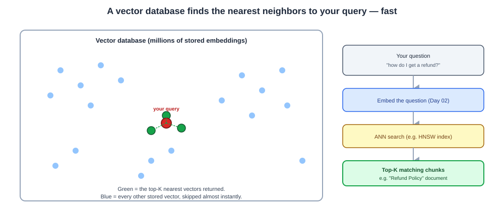
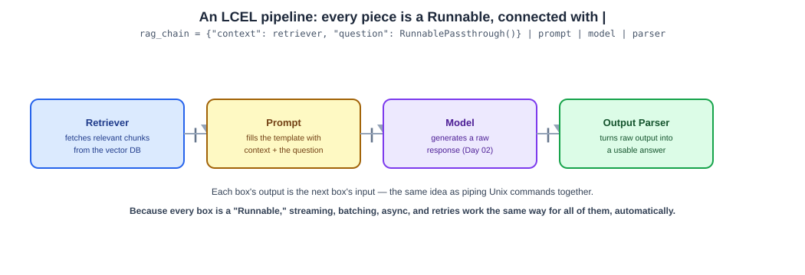

# Day 07 Notes — Embeddings, Vector DBs & LCEL Composition

**Module:** Module 4 · **Objectives covered:** embeddings with vector databases · building pipelines
with LCEL (runnables, chains, composition)

## TL;DR (short version)

- A **vector database** stores embeddings (Day 02) and finds the closest ones to a query vector, fast
  — even across millions of vectors.
- It does this with **approximate nearest neighbor (ANN)** search, trading a tiny bit of accuracy for
  huge speed, instead of comparing your query against every single vector one by one.
- **LCEL** (LangChain Expression Language) lets you build a chain by connecting pieces with `|`, the
  same way you'd pipe commands together in a terminal — `retriever | prompt | model | parser`.
- Every LCEL piece is a **Runnable** — the same standard shape — so anything can connect to anything,
  and you get streaming, batching, and retries automatically, for free.

---

## 1. Embeddings with vector databases

Day 02 covered what an embedding *is*. Today's question is: once you have millions of them, how do you
actually store and search them?

**A vector database** stores each embedding alongside its original text and metadata, and can answer
one question fast: *"which stored vectors are closest to this query vector?"*

```
Document chunks (Day 06)  →  embed each one (Day 02)  →  store [vector + text + metadata] in the DB
User's question  →  embed it too  →  ask the DB for the top-K closest vectors  →  get back matching chunks
```

**Why not just loop through every vector and compare?** That works fine for a thousand vectors, but at
a million or a billion, checking every single one for every query is far too slow. Vector databases use
special indexing (commonly **HNSW** — Hierarchical Navigable Small World graphs) to find *approximately*
the closest matches almost instantly, instead of *exactly* the closest ones slowly. This tradeoff —
slightly less precise, dramatically faster — is called **approximate nearest neighbor (ANN)** search.

**Named vector databases you'll actually see:** Pinecone, Qdrant, Weaviate, Chroma, Milvus, and
`pgvector` (a vector extension for regular Postgres). FAISS is a widely used library for this same
search, rather than a full hosted database.



> **Why / How / Where / When**
> - **Why:** RAG needs to find the handful of relevant chunks out of possibly millions, in well under a
>   second — brute-force comparison doesn't scale to that.
> - **How:** embed once at ingestion time (Day 06) and store it; embed the query at request time; use
>   ANN search (HNSW or similar) to retrieve the top-K nearest vectors.
> - **Where:** the retrieval step of every RAG pipeline, and semantic search features in real products.
> - **When:** store new documents as they're ingested (this can happen continuously); search happens on
>   every single user query.

## 2. Building pipelines with LCEL

**LCEL (LangChain Expression Language)** is a way to build a chain by connecting pieces with the `|`
symbol — the same idea as piping commands together in a terminal, where each step's output becomes the
next step's input.

```python
chain = prompt | model | output_parser
```
Read left to right: build the prompt → send it to the model → parse the model's raw output into a
usable form. This is exactly Day 03's "chain = fixed sequence of steps," written in actual code.

**Why this works for *any* combination of pieces:** every LCEL piece — a prompt template, a model, an
output parser, a retriever, even a plain function — implements the same standard interface, called a
**Runnable**. Because they all share that one shape, any of them can be piped into any other with `|`,
the same way any two Unix commands can be piped together because they all read from stdin and write to
stdout.

**A retrieval pipeline in LCEL:**
```python
rag_chain = {"context": retriever | format_docs, "question": RunnablePassthrough()} | prompt | model | parser
```
The retriever fetches relevant chunks (Section 1), `format_docs` turns them into text, the question
passes through unchanged, both feed into the prompt, which goes to the model, whose output gets parsed
into the final answer.

**What is `format_docs`?** A tiny helper you write yourself. A retriever returns a **list of `Document`
objects**, but the prompt needs plain **text** for `{context}`. `format_docs` joins each document's text
into one string, with a blank line between them:
```python
def format_docs(docs):
    return "\n\n".join(d.page_content for d in docs)
```
```
[Document(refund policy...), Document(password reset...)]  →  format_docs  →  "refund policy...\n\npassword reset..."
```
Without it, the prompt would contain the raw list — ids, `metadata={}`, `Document(...)` wrappers — which
is noise the model shouldn't have to read.

**Wait — you only pass ONE string to `.invoke()`. How does it become both `context` and `question`?**
The curly-brace part is a **dict**, and LangChain treats a dict as "run every value with the **same
input**, and collect the results under the same keys." So your one string goes down both branches:
```
rag_chain.invoke("how do I get my money back?")
      │
      ├─► "context":  retriever | format_docs   →  "Our refund policy allows returns within 30 days..."
      └─► "question": RunnablePassthrough()      →  "how do I get my money back?"   (unchanged)
                          │
                          ▼
   prompt template  "...{context}...  Question: {question}"   ←  filled by matching dict KEYS to {placeholder} NAMES
```
That's why the keys must be spelled exactly like the `{placeholders}` in the prompt. (Behind the scenes
LangChain wraps the dict in a `RunnableParallel`; the notebook shows this middle step with real output.)



**What you get for free just by using this pattern:**
- **Streaming** — get tokens back as they're generated, instead of waiting for the whole answer.
- **Batching** — process many inputs efficiently at once.
- **Async support** — run many requests concurrently without extra code.
- **Automatic retries and fallbacks**, and built-in tracing (this is exactly what LangSmith/Langfuse
  from Day 03 hook into).

> **Why / How / Where / When**
> - **Why:** before this pattern, chains were built with more verbose, inconsistent code, and features
>   like streaming had to be wired up by hand for every chain.
> - **How:** every piece implements the same Runnable interface, so `|` always means "pass this step's
>   output as the next step's input" — no matter what the two steps actually are.
> - **Where:** this is how most real LangChain pipelines are written today — RAG chains, simple
>   prompt-and-generate chains, anything with more than one step.
> - **When:** reach for LCEL composition the moment a task needs more than a single prompt-to-model
>   call — even two steps benefit from streaming and tracing coming along for free.

## Interview Q&A (Day 07)

**Q1. Why do you need a vector database instead of just storing embeddings in a list and looping
through them?**
Looping through every vector to find the closest match works for small datasets, but doesn't scale —
comparing a query against millions of vectors one by one is far too slow for a real-time request. Vector
databases use approximate nearest neighbor indexing (like HNSW) to find near-matches almost instantly.

**Q2. What is "approximate nearest neighbor" search, and what's the tradeoff?**
It's a search method that finds vectors that are *very likely* the closest matches, without checking
every single one exactly — trading a small amount of precision for a large gain in speed, which is
necessary at the scale RAG systems actually operate at.

**Q3. Name a few real vector databases.**
Pinecone, Qdrant, Weaviate, Chroma, Milvus, and pgvector (a Postgres extension). FAISS is a widely used
library for the same underlying search, rather than a full hosted database.

**Q4. What is LCEL, and what does the `|` operator actually do?**
LCEL (LangChain Expression Language) lets you build a chain by connecting pieces with `|`, where each
step's output becomes the next step's input — the same idea as piping Unix commands together. It works
because every piece implements a shared "Runnable" interface.

**Q5. What do you get automatically by building a chain with LCEL instead of writing the steps by
hand?**
Streaming, batching, async support, automatic retries/fallbacks, and built-in tracing — all of this
comes from every piece sharing the same Runnable interface, instead of having to be wired up separately
for each custom chain.

**Q6. In `{"context": retriever, "question": RunnablePassthrough()} | prompt`, you only call
`.invoke("some question")` once. How do both `context` and `question` get filled?**
A dict of runnables is treated as a `RunnableParallel`: it runs every value with the same input and
returns a dict with the same keys. The one question string goes to the retriever (which returns the
matching documents as `context`) and to `RunnablePassthrough()` (which returns the string unchanged as
`question`). The prompt template then fills its `{context}` and `{question}` placeholders by matching
those dict keys to the placeholder names.

## Sources

- [LangChain: LCEL](https://python.langchain.com/docs/concepts/lcel/)
- [Qdrant: What is a vector database?](https://qdrant.tech/articles/what-is-a-vector-database/)
