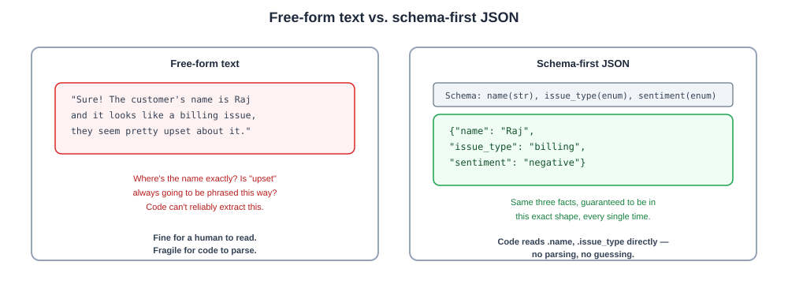
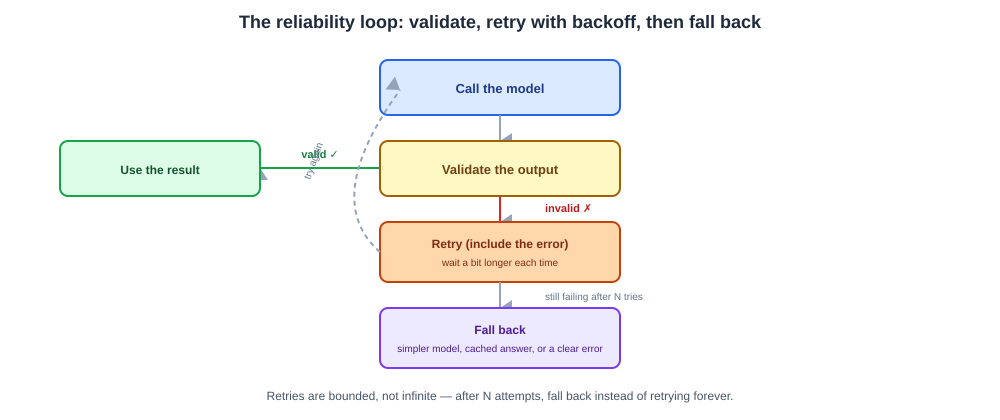

# Day 08 Notes — Structured Outputs, Reliability & API Deployment

**Module:** Module 4 · **Objectives covered:** schema-first structured outputs · reliability
(validation/retries/fallbacks) · deploying pipelines as APIs · tool integration patterns

## TL;DR (short version)

- **Schema-first JSON** = you define the exact shape of the answer you want *before* asking the model,
  so your code can parse it directly instead of guessing at free-form text.
- **Reliability** = validate the output, retry on failure, and fall back to something safe if retries
  don't work — because LLM calls aren't 100% reliable.
- **API deployment** = wrap your pipeline behind an HTTP endpoint (commonly FastAPI) so other apps can
  actually call it.
- **Tool integration patterns** = give every tool the same kind of schema (name, description, inputs)
  so tools are consistent and reusable across chains and agents.

---

## 1. Structured outputs with schema-first JSON

By default, an LLM produces free-form text — great for a chat reply, terrible for code that needs to
reliably read a specific field out of the response.

**Schema-first** means you define the exact shape you want *before* asking — field names and types —
and the model fills in exactly that shape.

```
Free-form:     "Sure! The customer's name is Raj and it looks like a billing issue, they seem upset."
Schema-first:  {"name": "Raj", "issue_type": "billing", "sentiment": "negative"}
```



> **Why / How / Where / When**
> - **Why:** your code can't reliably regex-parse a sentence, but it can always read a known JSON
>   field. Schema-first removes the guessing.
> - **How:** define a schema (in Python, usually a Pydantic model), pass it to the model (most modern
>   APIs support this directly — OpenAI's structured outputs, LangChain's
>   `with_structured_output()`), and the model's output is constrained to match it.
> - **Where:** anywhere an LLM's output feeds into code rather than being read directly by a human —
>   extraction tasks, classification, any step before another automated step.
> - **When:** any time downstream code needs to reliably read specific fields out of the answer, not
>   just display it.

## 2. Reliability: validation, retries, fallbacks

LLM calls aren't 100% reliable — the API can time out, the output can fail to match your schema, or the
answer can just be low quality. Production systems need a plan for all three.

- **Validation** — after getting a result, check it against your schema/rules before using it. Don't
  trust it blindly.
- **Retries** — if a call fails or fails validation, try again. Often the retry includes the error
  message, so the next attempt can specifically fix what went wrong. A short wait between retries that
  grows each time ("exponential backoff") avoids hammering a struggling service.
- **Fallbacks** — if retries are exhausted, fall back to something safe: a simpler/cheaper model, a
  cached answer, or a clear error message — never a crash.

```
Call model → validate output → invalid? → retry (with the error included) → still failing? → fallback
```



> **Why / How / Where / When**
> - **Why:** a single LLM call failing shouldn't take your whole application down — users expect a
>   response even when one attempt goes wrong.
> - **How:** validate with the same schema from Section 1, retry with backoff a small, bounded number
>   of times (Day 04's latency/cost tradeoffs apply here too), then fall back rather than retry forever.
> - **Where:** every production LLM call, not just agentic ones — even a single prompt-to-model chain
>   needs this.
> - **When:** design this in from the start; retrofitting reliability after an outage is much more
>   painful than building it in on day one.

## 3. Deploying pipelines as API services

A pipeline running in a notebook or script is only usable by you, in that one place. Wrapping it behind
an API lets other applications call it over the network.

```
Client sends POST /ask {"question": "..."} → your API runs the pipeline (Day 07's LCEL chain)
                                            → returns JSON {"answer": "...", "sources": [...]}
```

**How, concretely:** commonly built with **FastAPI** (Python) — you define an endpoint, it receives a
request, runs your chain, and returns a response. **Async** endpoints let one server handle many
requests at once without blocking on a slow LLM call (full container/CI-CD deployment detail comes in
Module 14).

> **Why / How / Where / When**
> - **Why:** other apps, a frontend, or other services need a stable way to call your pipeline without
>   knowing anything about how it's built internally.
> - **How:** define request/response schemas (Section 1's schema-first idea, applied to the whole API),
>   wire the endpoint to your LCEL chain, and validate incoming requests before running anything.
> - **Where:** any pipeline meant to be used by more than a one-off script — a chatbot's backend, a
>   RAG system a frontend calls.
> - **When:** once a pipeline moves from "working in my notebook" to "something other people or systems
>   need to use."

## 4. Tool integration patterns

Day 05 covered *why* an agent uses tools. This is about making tools consistent and reusable across a
whole system, not just one chain.

- Give every tool the same shape: a **name**, a **description** (so the model knows when to use it),
  and typed **input parameters** (the same schema-first idea from Section 1, applied to tool calls).
- Keep tool definitions centralized so multiple chains or agents can share the same tools instead of
  each one redefining its own copy.
- This consistency is exactly what Module 9's **MCP (Model Context Protocol)** formalizes into a
  standard that works across different agents and systems, not just inside one codebase.

> **Why / How / Where / When**
> - **Why:** inconsistent, one-off tool definitions get hard to maintain and reuse as a system grows
>   past a single chain.
> - **How:** describe every tool the same way (name/description/typed inputs), whether it's a search
>   function, a database query, or an API call.
> - **Where:** any system with more than one agent or chain that needs to call the same underlying
>   capability (e.g. a search tool used by both a support bot and a research agent).
> - **When:** worth doing from the start if you expect more than one tool or more than one consumer of
>   that tool — Module 9 goes deep on the full standard.

## Interview Q&A (Day 08)

**Q1. Why use schema-first structured output instead of just parsing the model's free text?**
Free text is unpredictable — the exact wording, field order, or presence of a value can vary between
calls, breaking naive parsing (like regex). Schema-first output constrains the model to a known shape,
so code can reliably read specific fields without guessing.

**Q2. Walk through the reliability pattern for a production LLM call.**
Call the model, validate the output against the expected schema, and if it fails, retry — ideally
including the validation error so the next attempt can specifically correct it — with a growing wait
between attempts. After a bounded number of retries, fall back to something safe (a simpler model, a
cached answer, or a clear error) instead of retrying forever or crashing.

**Q3. Why does retry logic usually include exponential backoff instead of retrying immediately?**
Retrying immediately can hammer a service that's already struggling (e.g. rate-limited or overloaded),
making things worse. A growing wait between attempts gives the service time to recover and reduces the
chance of triggering rate limits.

**Q4. What does it mean to deploy a pipeline "as an API," and why is that different from running it in
a script?**
It means wrapping the pipeline behind an HTTP endpoint (e.g. with FastAPI) so other applications can
call it over the network with a request and get a structured response back — instead of the pipeline
only being runnable by whoever has the script open.

**Q5. Why standardize how tools are defined across a system instead of letting each chain define its
own?**
Consistent tool definitions (name, description, typed inputs) can be shared and reused across multiple
chains or agents, instead of every chain redefining the same capability slightly differently — which
becomes hard to maintain as a system grows. This consistency is exactly what MCP (Module 9) formalizes.

## Sources

- [OpenAI: Structured model outputs](https://developers.openai.com/api/docs/guides/structured-outputs)
- [FastAPI documentation](https://fastapi.tiangolo.com/)
