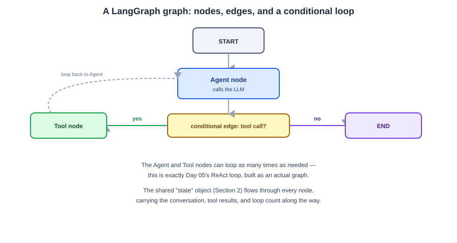
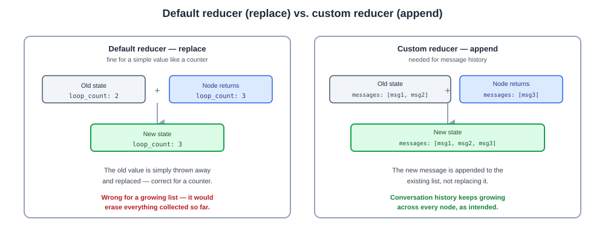

# Day 09 Notes — LangGraph Fundamentals & State

**Module:** Module 5 · **Objectives covered:** LangGraph fundamentals (nodes, edges, state) · state
schemas and reducers

## TL;DR (short version)

- **LangGraph** builds agents as a **graph**: steps (**nodes**) connected by rules about what runs next
  (**edges**), sharing one **state** object that flows through the whole thing.
- It exists because plain chains (Day 07's LCEL) are linear — they can't loop or branch. Agents need
  both (Day 05's ReAct loop, Day 04's architectures).
- A **state schema** defines the shape of that shared object in advance — its fields and types.
- A **reducer** defines *how* a field gets updated — replace it, or combine it with what was already
  there (like appending to a running list of messages).

---

## 1. LangGraph fundamentals

**Why not just use a Day 07 LCEL chain?** A chain is linear — step A always leads to step B, always in
that order. But agents (Day 04, Day 05) need to **loop** (ReAct's Thought → Action → Observation,
repeating) and **branch** (different next steps depending on what just happened). LangGraph models an
agent as a graph instead of a straight line, so loops and branches are first-class, not a workaround.

**The core pieces:**
- **Node** — one step: a function that reads the current state, does something (call the LLM, call a
  tool, check a condition), and returns updates to the state.
- **Edge** — a rule for what runs next after a node. A **fixed edge** always goes to the same next
  node. A **conditional edge** picks the next node based on the current state — this is how branches
  and loops actually get built.
- **State** — one shared object every node can read and update as it flows through the graph (full
  detail in Section 2).

```
START → Agent node (calls the LLM)
           │
           ├─ conditional edge: "did it ask for a tool?"
           │      yes → Tool node → back to Agent node (loop)
           │      no  → END
```



> **Why / How / Where / When**
> - **Why:** Day 05's ReAct pattern and Day 04's agent architectures both need loops and branches — a
>   linear chain literally cannot represent "keep going until done."
> - **How:** define nodes as functions, connect them with edges (some conditional), and run the graph
>   starting from an entry point until it reaches an end point.
> - **Where:** this is how the multi-step agents from Module 3 (Days 4-5) actually get built in code,
>   and it's the foundation Project 2 (Multi-Agent Collaboration) is built on later in this course.
> - **When:** reach for LangGraph the moment a task needs a loop, a branch, or state that persists
>   across multiple steps — a straight-line LCEL chain (Day 07) is simpler and enough otherwise.

## 2. State schemas and reducers

**A state schema** defines the shape of the shared object every node reads and writes — its fields and
their types, decided in advance (the same schema-first idea from Day 08, applied to the whole graph's
memory).

```
Example state schema:  { messages: list[Message], retrieved_docs: list[str], loop_count: int }
```

**A reducer** defines *how* a field gets updated when a node returns a new value for it. By default, a
node's returned value just **replaces** the old one — fine for something like a counter. But for a
list you're building up over many steps (like conversation history), replacing would throw away
everything collected so far. A reducer tells the graph to **combine** the new value with the old one
instead — most commonly, append to the list.

```
Default reducer (replace) — fine for a counter:
  old state {loop_count: 2}  +  node returns {loop_count: 3}  →  new state {loop_count: 3}

Custom reducer (append) — needed for message history:
  old state {messages: [msg1, msg2]}  +  node returns {messages: [msg3]}  →  new state {messages: [msg1, msg2, msg3]}
```

Without the append reducer on `messages`, every node's output would silently wipe out the whole
conversation so far, keeping only its own new message.



> **Why / How / Where / When**
> - **Why:** different fields need different update behavior — a loop counter should be replaced, a
>   message history should be appended to. One default wouldn't work for both.
> - **How:** define the schema (often a `TypedDict` or Pydantic model in Python), and attach a reducer
>   function to any field that needs to accumulate rather than replace (LangGraph ships a common one,
>   `add_messages`, for exactly the chat-history case).
> - **Where:** every LangGraph graph has a state schema — it's the shared memory every node reads and
>   writes as the graph runs.
> - **When:** use the default (replace) for simple values like counters or flags. Add a custom reducer
>   whenever a field needs to grow or merge across steps instead of being overwritten.

## Interview Q&A (Day 09)

**Q1. Why would you reach for LangGraph instead of a plain LCEL chain?**
LCEL chains are linear — one fixed sequence of steps. LangGraph models an agent as a graph of nodes and
edges, where edges can be conditional, which is what actually lets you build loops (like ReAct) and
branches (different next steps depending on what happened) — neither of which a straight-line chain can
represent.

**Q2. What are nodes and edges in LangGraph?**
A node is one step — a function that reads the current state, does something, and returns updates to
it. An edge defines what runs next after a node; a conditional edge picks the next node based on the
current state, which is how branching and looping get built.

**Q3. What is a state schema, and why define it upfront?**
It's the defined shape (fields and types) of the shared object every node in the graph reads and
writes. Defining it upfront, the same way you'd define a schema for structured output (Day 08), means
every node knows exactly what data it can expect and produce.

**Q4. What is a reducer, and why isn't the default behavior always enough?**
A reducer defines how a field gets updated when a node returns a new value for it. The default just
replaces the old value, which works for something like a counter, but would silently delete
accumulated data for a field like message history — a reducer like "append" combines the new value
with what was already there instead of overwriting it.

**Q5. Give a concrete example of when you'd need a custom reducer instead of the default.**
A conversation's message history: each node might add one new message, but you want the full history to
keep growing across every step, not get replaced down to just the newest message. A custom reducer
(e.g. LangGraph's built-in `add_messages`) appends instead of replacing.

## Sources

- [LangGraph overview](https://docs.langchain.com/oss/python/langgraph/overview)
