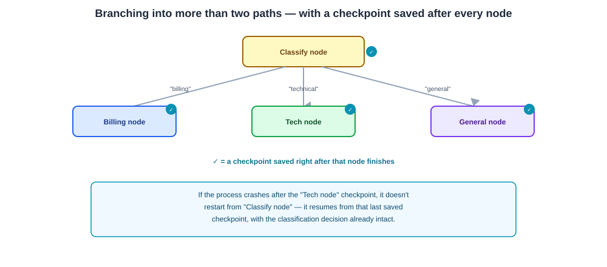
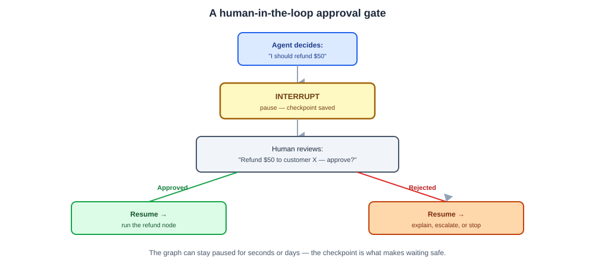

# Day 10 Notes — Branching Graphs, Checkpoints & Human-in-the-Loop

**Module:** Module 5 · **Objectives covered:** branching graphs with checkpoints · human-in-the-loop
approval gates

## TL;DR (short version)

- **Branching** = a node's output decides which of several next nodes runs — not just a binary yes/no
  (Day 09), but a real router (Day 04) built into the graph itself.
- **Checkpoints** = LangGraph saves the graph's state after every node, so it can be paused, resumed,
  or recovered from a crash without starting over.
- **Human-in-the-loop** = the graph pauses at a specific point and waits for a person to approve or
  reject before continuing — and checkpoints are exactly what makes that pause safe and indefinite.

---

## 1. Branching graphs with checkpoints

Day 09 showed a simple conditional edge (yes/no: call a tool or not). A real branching graph can send
the state down any of several different paths, based on whatever the current node decided — the router
architecture from Day 04, built directly into the graph's structure.

```
                     ┌─ "billing question" → Billing node
Classify node ───────┼─ "technical question" → Tech node
                     └─ "general question" → General node
```

**Checkpoints** are the other half of today: LangGraph can save a snapshot of the state after every
node runs. That snapshot means the graph can be:
- **Resumed after a crash** — pick back up from the last checkpoint instead of redoing everything.
- **Paused and resumed later** — even after the whole program restarts, since the state was actually
  saved, not just held in memory.
- **Inspected for debugging** — you can look at exactly what the state was at any past point (Day 04's
  auditability).

```
Node A runs → checkpoint saved → Node B runs → checkpoint saved → [crash or pause]
                                                                          ↓
                                          resume from the last checkpoint — no redo needed
```



> **Why / How / Where / When**
> - **Why:** long-running or multi-step agents shouldn't have to restart from scratch after a crash, and
>   some steps genuinely need to branch into more than two possible paths.
> - **How:** a "checkpointer" (in-memory for testing, or backed by a real database like SQLite/Postgres
>   for production) automatically saves the state after each node completes.
> - **Where:** any graph long enough or important enough that losing progress on failure would be
>   costly — and, as Section 2 shows, anywhere a human needs to pause the process.
> - **When:** branching whenever there are genuinely more than two possible next steps; checkpointing
>   any time a graph runs long enough, or matters enough, that "just start over" isn't acceptable.

## 2. Human-in-the-loop approval gates

Day 05 said risky actions should require human approval. Today is *how* that actually gets built: an
**interrupt** point in the graph.

Before a risky node runs, the graph pauses — using the same checkpoint mechanism from Section 1 — and
waits for a human's decision before continuing. Because the state was actually saved, the graph can sit
paused indefinitely, even across a server restart, until someone responds.

**Example:** an agent decides to issue a refund.
```
Agent: "I should refund $50 to this customer"
   ↓
INTERRUPT — pause, checkpoint saved
   ↓
Human reviews: "Refund $50 to customer X — approve?"
   ↓
   ├─ Approved → resume → run the refund node
   └─ Rejected → resume → take a different path (explain, escalate, or stop)
```



> **Why / How / Where / When**
> - **Why:** some actions (sending money, deleting data, sending a message on someone's behalf) are too
>   risky to let an agent take fully unsupervised, no matter how good its reasoning looks.
> - **How:** place an interrupt before the risky node; the checkpoint captures the state exactly where
>   it paused, so resuming later — approved or rejected — continues correctly from that exact point.
> - **Where:** any action with real-world consequences that are hard or impossible to undo (Day 04's
>   security module, Day 05's design principle, now actually implemented).
> - **When:** decide *before* building the graph which nodes are risky enough to need this — adding it
>   as an afterthought after something goes wrong is a much worse position to be in.

## Interview Q&A (Day 10)

**Q1. What does a checkpoint actually let a LangGraph application do that it couldn't do otherwise?**
Resume from where it left off after a crash instead of restarting from scratch, pause and resume later
even across a program restart (since state is actually saved, not just held in memory), and let you
inspect exactly what the state was at any past point for debugging.

**Q2. How is a branching graph different from a simple conditional edge?**
A simple conditional edge picks between two outcomes (yes/no). A branching graph can send the state
down any of several different paths based on a node's output — the same idea as Day 04's router
architecture, but built directly into the graph's structure instead of being a separate step.

**Q3. How does a human-in-the-loop approval gate actually work, mechanically?**
An interrupt point is placed before a risky node. When the graph reaches it, it pauses and the current
state is checkpointed. A human reviews and approves or rejects; the graph then resumes from that exact
saved state down whichever path matches the decision.

**Q4. Why are checkpoints specifically what makes human-in-the-loop practical, not just a nice-to-have?**
Without checkpointing, pausing for a human would mean holding the process open and blocking indefinitely
(fragile, and lost entirely on a crash or restart). Because the state is actually saved, the graph can
sit paused for any length of time — seconds or days — and resume correctly whenever the human responds.

**Q5. Give an example of a node you'd put an interrupt before, and one you wouldn't.**
Put one before an irreversible or costly action — sending a payment, deleting a record, sending an
email to a customer. You wouldn't put one before a read-only step like retrieving documents or
formatting a draft, since there's nothing risky to approve yet.

## Sources

- [LangGraph: Persistence and checkpointing](https://docs.langchain.com/oss/python/langgraph/persistence)
- [LangGraph overview](https://docs.langchain.com/oss/python/langgraph/overview)
