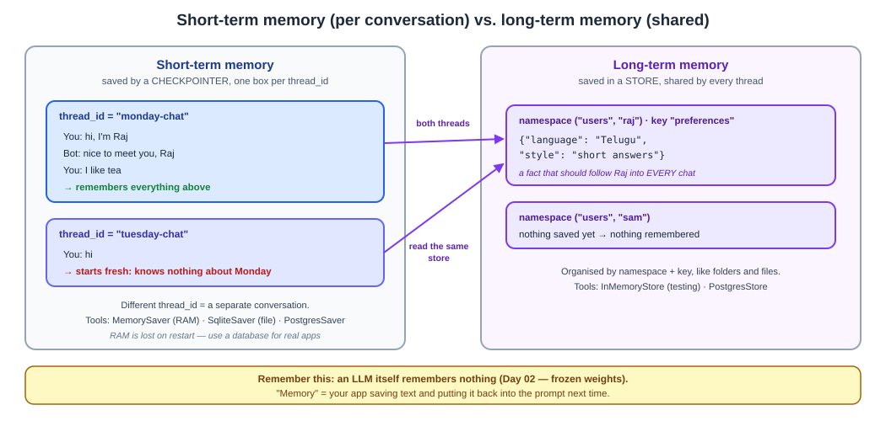
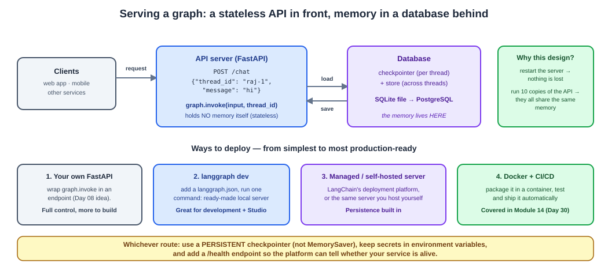
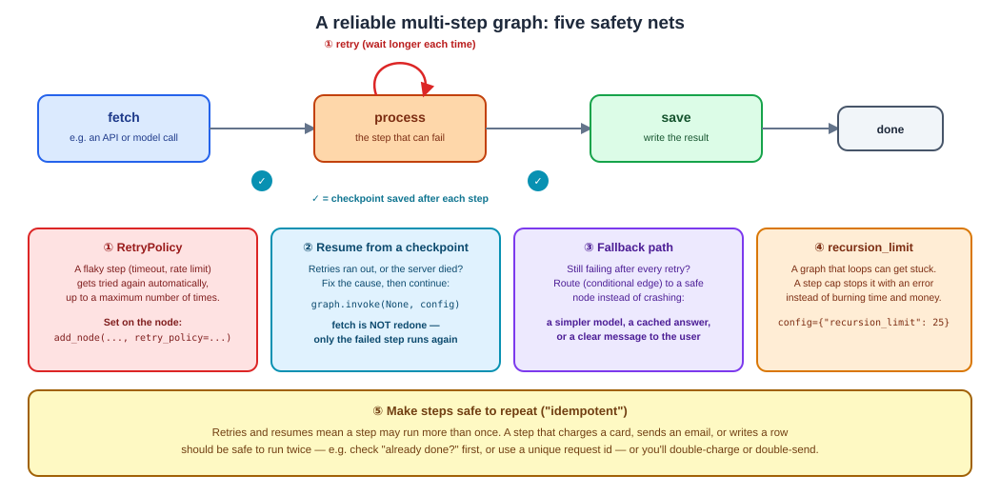

# Day 11 Notes — Agent Memory, Deployment & Reliability

**Module:** Module 5 · **Objectives covered:** short-term and long-term memory · deploying graph-based
workflows · orchestrating reliable multi-step systems

## TL;DR (short version)

- An LLM remembers **nothing** by itself (Day 02). "Memory" means **your app saves text and puts it back
  into the prompt** next time.
- **Short-term memory** = the conversation so far, saved per `thread_id` by a **checkpointer**.
- **Long-term memory** = facts that follow a user into every new chat, saved in a **store**.
- To **deploy** a graph, put a **stateless API** in front and keep the memory in a **database**.
- To make a multi-step graph **reliable**: retry flaky steps, resume from checkpoints, add a fallback,
  cap loops, and make steps safe to repeat.

---

## 1. Memory: short-term and long-term

**First, a mindset fix.** The model's weights are frozen after training (Day 02). It cannot "remember" your
last message. What looks like memory is your application saving the earlier messages and sending them
again inside the next prompt.

```
Turn 1:  "hi, I like tea"  →  saved in the graph's state
Turn 2:  prompt = [turn 1 messages] + "what do I like?"  →  the model can now answer "tea"
```

There are two kinds of memory, with two different tools in LangGraph:

| | Short-term memory | Long-term memory |
|---|---|---|
| What it holds | The conversation so far | Facts that should outlive a conversation |
| Scope | One **thread** (one conversation) | **Shared** across all threads |
| Saved by | A **checkpointer** | A **store** |
| Organised by | `thread_id` | namespace + key (like folders and files) |
| Example | "You just told me you like tea" | "Raj prefers short answers in Telugu" |
| Tools | `MemorySaver` (RAM), `SqliteSaver` (file), `PostgresSaver` | `InMemoryStore` (testing), `PostgresStore` |

```
same thread_id   →  "hi, I'm Raj" … "what's my name?"  →  remembers (short-term memory)
new  thread_id   →  "what's my name?"                    →  no idea   (short-term is per thread)
new  thread_id   →  reads the store for "users/raj"      →  knows his preferences (long-term memory)
```



**Three kinds of things you might store long-term** (interviewers like these names):
- **Semantic memory** — facts ("Raj's favourite language is Telugu").
- **Episodic memory** — past experiences ("last time this approach worked / failed").
- **Procedural memory** — rules for how to behave ("always answer in short sentences").

**What if the conversation gets too long?** Short-term memory keeps growing, but the context window is
limited (Day 02) and you pay for every token. Three common fixes:
- **Trim** — keep only the last N messages (LangChain has a `trim_messages` helper).
- **Summarize** — replace old messages with a short summary.
- **Move important facts to long-term memory** — so they survive even after trimming.

**Memory that disappears on restart isn't real memory.** `MemorySaver` and `InMemoryStore` live in RAM.
For real apps, use a database-backed one: a SQLite file for small apps, PostgreSQL for production. The
notebook proves it: a brand-new graph on the same SQLite file still remembers the earlier message.

> **Why / How / Where / When**
> - **Why:** users expect an assistant to remember what they said, and to remember *them* next week.
> - **How:** compile the graph with a checkpointer (short-term, keyed by `thread_id`) and, for long-term
>   facts, a store (namespace + key). Nodes read and write the store like a small database.
> - **Where:** every chatbot, support agent, or personal assistant that talks to the same person more
>   than once.
> - **When:** short-term memory from the very first multi-turn feature; add long-term memory once you have
>   facts worth keeping across conversations — and switch to a persistent database before real users.

## 2. Deploying graph-based workflows

A graph in a notebook is only usable by you. To let other apps call it, serve it over the network.

**The one design rule:** keep the API **stateless** and put the memory in a **database**. Each request
carries a `thread_id`; the API passes it to the graph; the graph loads and saves the conversation from the
database.

```
POST /chat {"thread_id": "raj-1", "message": "hi"}  →  graph.invoke(input, thread_id)  →  load/save from the database  →  reply
```

Why that works: restart the server and nothing is lost, and you can run 10 copies of the API that all share
the same memory.



**Four ways to deploy, from simplest to most production-ready:**
1. **Your own FastAPI app** — wrap `graph.invoke` in an endpoint (the notebook does this, with a real
   SQLite file). Full control, but you build everything yourself.
2. **`langgraph dev`** — add a small `langgraph.json` file and run one command to get a ready-made local
   server with an API (and LangGraph Studio for debugging).
3. **A managed or self-hosted LangGraph server** — the same server, run for you or by you, with
   persistence built in.
4. **Docker + CI/CD** — package it in a container and ship it automatically (Module 14, Day 30).

A minimal `langgraph.json` (not run in the notebook — it needs the LangGraph CLI installed):
```json
{
  "dependencies": ["."],
  "graphs": { "my_agent": "./my_agent.py:graph" },
  "env": ".env"
}
```

**Deployment checklist:** use a **persistent** checkpointer (never `MemorySaver`), keep API keys in
**environment variables**, validate requests with a schema (Day 08), and add a `/health` endpoint.

> **Why / How / Where / When**
> - **Why:** other apps, a website, or a mobile app can't run your notebook — they need an API.
> - **How:** an endpoint that takes a `thread_id` and a message, calls `graph.invoke`, and returns the
>   reply, with a database-backed checkpointer keeping the conversations.
> - **Where:** behind any product that uses your agent — a chat widget, an internal tool, another service.
> - **When:** once the graph works in a notebook and someone else needs to use it.

## 3. Orchestrating reliable multi-step systems

A multi-step graph has many places to fail: a timeout in step 2, a crash in step 3, a loop that never ends.
"Reliable" means each of those has a plan. Five safety nets:

1. **Retry** — give a flaky node a `RetryPolicy` and it tries again automatically, up to a maximum number of
   times (Day 08's retry idea, built into the graph).
2. **Resume from a checkpoint** — when retries run out or the server dies, the state saved after each step
   lets you continue with `graph.invoke(None, config)`. Finished steps are **not** redone.
3. **Fallback path** — if a step still fails, route (with a conditional edge) to a safe node: a simpler
   model, a cached answer, or a clear message. Better than crashing.
4. **A step cap** — `recursion_limit` stops a graph that loops forever, instead of burning time and money.
5. **Idempotent steps** — because retries and resumes can run a step **twice**, a step that charges a card
   or sends an email must be safe to repeat (check "already done?" first, or use a unique request id).

```
fetch ✓ → process ✗ (crash) → checkpoint says: "fetch done, process pending"
   →  fix the problem  →  graph.invoke(None, config)  →  process runs again  →  save ✓
   fetch ran 1 time · process ran 2 times · save ran 1 time
```



**Where the earlier days fit in:** validation and structured output (Day 08) catch bad model output;
checkpoints and approval gates (Day 10) pause and resume; today's retry, cap, and idempotency rules finish
the picture. Later, Module 12 adds tracing and evaluation so you can *see* failures in production.

> **Why / How / Where / When**
> - **Why:** real systems call slow, flaky, paid services. A graph without safety nets fails on the first
>   hiccup, or worse, silently loops or double-charges.
> - **How:** `RetryPolicy` on nodes, a persistent checkpointer for resume, conditional edges for
>   fallbacks, `recursion_limit` in the run config, and steps written to be safe to repeat.
> - **Where:** any graph that calls external APIs, models, or databases — which is almost every real one.
> - **When:** design it in from the start; the expensive lesson is learning it after an outage or a
>   double-charge.

## Interview Q&A (Day 11)

**Q1. Does an LLM remember earlier messages in a conversation?**
No. Its weights are frozen after training. What looks like memory is the application saving earlier
messages and sending them back inside the next prompt. In LangGraph, that saved conversation is the
graph's state, kept by a checkpointer.

**Q2. What's the difference between short-term and long-term memory in LangGraph?**
Short-term memory is the state of one conversation (thread), saved by a checkpointer under a `thread_id`.
Long-term memory is data shared across all threads — like user preferences — saved in a store, organised by
namespace and key.

**Q3. What is a `thread_id` for?**
It identifies one conversation. The checkpointer saves and loads state under that id, so the same id
continues the same conversation and a new id starts a fresh one.

**Q4. Why shouldn't you use `MemorySaver` in production, and what do you use instead?**
`MemorySaver` keeps everything in RAM, so a restart wipes all conversations, and multiple server copies
wouldn't share it. Use a persistent checkpointer — `SqliteSaver` for small apps or `PostgresSaver` for
production — plus a database-backed store for long-term memory.

**Q5. A conversation has grown longer than the model's context window. What are your options?**
Trim the history to the last N messages, summarize older messages into a short summary, and move
important facts into long-term memory so they survive trimming.

**Q6. How would you deploy a LangGraph agent?**
Simplest: wrap `graph.invoke` in a FastAPI endpoint that takes a `thread_id`. Or use `langgraph dev` with a
`langgraph.json` for a ready-made server, then a managed or self-hosted LangGraph server, and finally
Docker with CI/CD. In all cases keep the API stateless and the memory in a persistent database.

**Q7. Step 2 of a 3-step graph fails. How does LangGraph help you recover?**
A `RetryPolicy` on the node retries it automatically. If it still fails, the checkpoint saved after step 1
lets you resume with `graph.invoke(None, config)` — step 1 isn't repeated, only the failed step runs again.

**Q8. Why set a recursion limit on a graph?**
A graph with a loop can get stuck and run forever. The limit stops it with an error after a set number of
steps, which protects against runaway cost and time.

**Q9. Why should steps in a retry/resume workflow be idempotent?**
Retries and resumes can run the same step more than once. If the step charges a card or sends an email,
running it twice causes real harm, so it should check whether it already happened (or use a unique request
id) before acting.

## Sources

- [LangGraph: Memory overview](https://docs.langchain.com/oss/python/langgraph/memory)
- [LangGraph: Persistence (checkpointers)](https://docs.langchain.com/oss/python/langgraph/persistence)
- [LangGraph: Stores](https://docs.langchain.com/oss/python/langgraph/stores)
- [LangGraph: Run a local server (`langgraph dev`)](https://docs.langchain.com/oss/python/langgraph/local-server)
